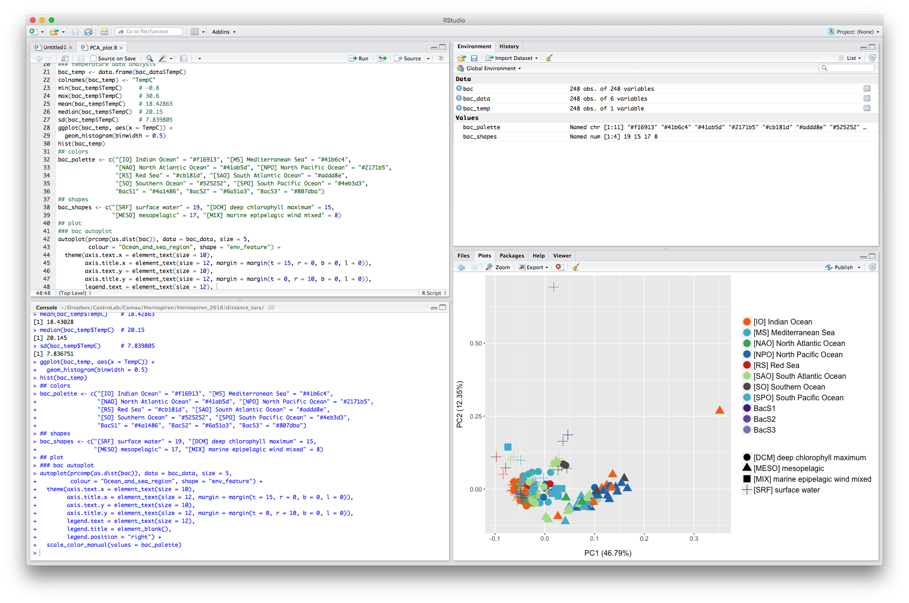
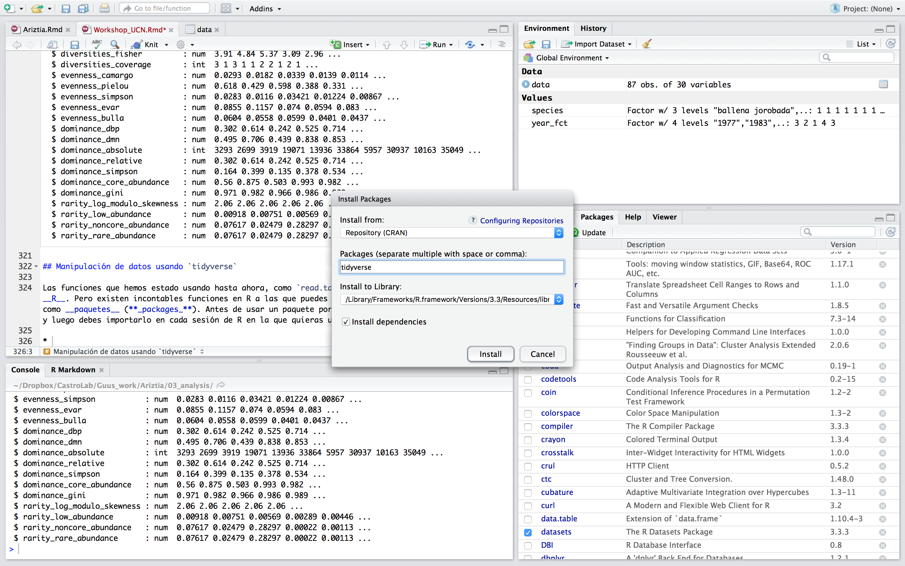

<div class="book without-animation with-summary font-size-2 font-family-1" data-basepath=".">

<div class="book-summary">

- [Introduction to R](./)

- - [**0.1** About the course](#workshop)

- [**1** Introduction to R](#introR)
  
  - [**1.1** Why R?](#por-que-r)
  - [**1.2** Getting to Know RStudio](#conociendo-rstudio)
  - [**1.3** Data Set We'll Work With](#set-de-datos-para-trabajar)
  - [**1.4** Getting Information from Tables](#extraer-informacion-de-tablas)
  - [**1.5** Factors](#factores)
    - [**1.5.1**Transforming Factors](#transformar-factores)
    - [**1.5.2** Renaming factors](#renombrar-factores)
    - [**1.5.3** Argument
      `stringsAsFactors`](#argumento-stringsasfactors)

- [**2** Data Manipulation in R](#manipulacion-de-datos-en-r)
  
  - [**2.1** Selecting columns and filtering rows](#seleccionar-columnas-y-filtrar-filas)
  - [**2.2** Nested Functions and
    ***pipes***](#funciones-anidadas-y-pipes)
  - [**2.3** ***Mutate***: creating new columns from existing information in other columns](#mutate-crear-nuevas-columnas-desde-informacion-existente-en-otras-columnas)
  - [**2.4** Divide -\> apply -\>
    combine](#dividir---aplicar---combinar)
  - [**2.5** Count](#contar)
  - [**2.6** Remodeling tables using `spread()` and
    `gather()`](#remodelar-tablas-usando-spread-y-gather)
  - [**2.7** Exporting data](#exportar-datos)

- [**3** Data visualization in R](#visualizacion-de-datos-en-r)
  
  - [**3.1** Graphing with `ggplot2`](#graficar-con-ggplot2)
  - [**3.2** Making figures step-by-step](#construyendo-graficos-iterativamente)
  - [**3.3** Boxplot](#boxplot)
  - [**3.4** Graphing with time data](#graficar-datos-con-series-de-tiempo)
  - [**3.5** *Faceting*](#faceting)
  - [**3.6** `ggplot2` *themes*](#ggplot2-themes)
  - [**3.7** Personalization](#personalizacion)
  - [**3.8** Organizing and exporting figures](#organizar-y-exportar-graficos)

- - [CASTRO LAB](http://www.castrolab.org)

- [ISME LA 2019](https://isme-la2019.org)

</div>

<div class="book-body">

<div class="body-inner">

<div class="book-header" role="navigation">

# [Introduction to R, Data Manipulation and Visualization in R](./)

</div>

<div class="page-wrapper" tabindex="-1" role="main">

<div class="page-inner">

<div id="section-" class="section normal">

<div id="header">

*ISME Latin America, September 2019*

</div>

<div id="workshop" class="section level2">

## <span class="header-section-number">0.1</span> About the Course

The following tutorial was created specifically as a practical guide to be completed during the 1st ISME (International Society for Microbial Ecology) Latin America Congress 2019: **Bioinformatic Data Analysis for Metagenomes and Amplicons Using R**. Which took place on the 9th and 10th of September, 2019 at the [Universidad Técnica
Federico Santa María](https://www.usm.cl), Valparaíso, Chile.

 [**Click Here to Go to the Initial Page of the Course**](http://castrolab.org/isme/bienvenida_WorkshopISME.html)

This course has 6 units. You are now in the unit: **Introduction to R: Data manipulation and visualization**


> **The Other Units of the Course are**:
> 
> [**Sequence Analysis of 16S with DADA2**](http://www.castrolab.org/isme/dada2/dada2.html)
> 
> 
> [**Introduction to phyloseq and to Diversity Analysis**](http://www.castrolab.org/isme/biodiversity/biodiversity.html)
> 
> 
> [**Searching for genes of interest in metagenomic shotgun data**](http://www.castrolab.org/isme/gene_search/gene_search.html)
> 
> 
> [**Genome visualization and Curation of Metagenome-assembled Genomes (MAGs)**](http://www.castrolab.org/isme/mags/mags.html)
> 
> 
> [**Microorganism Co-occurrence Networks**](http://www.castrolab.org/isme/microbial_networks/microbial_networks.html)
> 

-----

- Professor: **Dr. Eduardo Castro-Nallar** (<eduardo.castro@unab.cl>)

- Assistants:
  
  - **Dr. Florence Gutzwiller** (<florence.gutzwiller@gmail.com>)
  - **M.Sc. Katterinne N. Mendez** (<mendez.katterinne@gmail.com>)

**[CASTRO LAB](http://www.castrolab.org)**

[Center for Bioinformatics & Integrative Biology](http://www.cbib.cl) |
[Universidad Andrés Bello](https://www.unab.cl)


[Santiago, Chile](https://goo.gl/maps/BCe9hWcRZJKkhaDP8)

</div>

<div id="introR" class="section level1">

# <span class="header-section-number">1</span> Introduction to R

<div id="por-que-r" class="section level2">

## <span class="header-section-number">1.1</span> Why R?

Your analyses will be a series of written commands (R *script*), which is very convenient because:

- Allows you to have complete control and understanding of what you are doing (**goodbye to the black box** in your *in silico* analysis).
- **Reproducibility**\! If you need to repeat an analysis, add more data, or correct an error, you only need to run your *script* again and your statistical tests and figures will update automatically.
- Your analyses are clear and transparent, any of your colleges or even your future self can reed it to find errors and/or make it better.
- You can comment on your script. Addding comments, explanations, or a narrative to your code can help you explain, step by step, the *why* behind your analyses to your collegues and to your future self.

Other important advantages of using R are:

- **Scalability**\! R is designed for data analysis. The tools you will learn to use in R can be easily scaled with the size of your data sets (data sets in R can be hundreds of thousands, even millions of lines long).
- **High quality Figures**\! R has innumerable functionalites for all types of figures at your fingertips in order to achieve an effective visualization of your results. Visit **[The R Graph Gallery](http://www.r-graph-gallery.com/all-graphs/)** to see examples of what you might learn to do.
- **Lots of documentation**! R has plenty of documentation and the web is full of tutorials, you just have to look and you'll find it. For example,
  **[Cookbook for R](http://www.cookbook-r.com)** provides solutions for basic data analysis tasks.

Learning R can be difficult and can take time in the beginning but don't worry, you're not alone! R has a large community of users that are willing to help via *mailing-lists* and *websites* like [Stack
Overflow](https://stackoverflow.com/) and [RStudio
community](https://community.rstudio.com/). That being said, the most likely scenario is that your question is already answered and that the solution can be found via a **[Google](https://www.google.com)** search using keywords or by **copying the error message that appears in the R console and pasting this into the search box**.

</div>

<div id="conociendo-rstudio" class="section level2">

## <span class="header-section-number">1.2</span> Getting to know RStudio

Everything you need in a window! As you can see in the image below, RStudio is divided into 4 main panels:

1. Upper left panel: text editor in which you can write commands/instructions (*R scripts*). You can also add comments here.
2. Lower left panel: R console, this is where the lines of your script are executed.
3. Upper right panel: Here you can visualize data currently loaded into the memory of R.
4. Lower right panel: here you will encounter five tabs: *Files/Plots/Packages/Help/Viewer* in which you can navigate your file structure, view your figures in real time, manage your R packets, and ask for help.

 RStudio interface

Básicamente, lo que haremos es escribir instrucciones (a lo que llamamos
comandos) en el lenguaje de programación R, y luego le indicaremos al
computador que ejecute la instrucción (a lo que llamamos ejecutar o
correr). En RStudio puedes escribir los comandos en el editor de texto y
luego ejecutarlos, una línea de código a la vez, presionando `Ctrl` +
`Enter` (`cmd` + `return` en Mac). Cuando ejecutas comandos, es
importante poner atención a la consola. Si hubo algún problema con la
ejecución de la instrucción, aparecerá un mensaje de error en la
consola. Cuando el computador finaliza la instrucción, un nuevo `>`
aparece en la consola indicando que a finalizado de ejecutar el último
comando y está listo para correr el siguiente.

</div>

<div id="set-de-datos-para-trabajar" class="section level2">

## <span class="header-section-number">1.3</span> Set de datos para trabajar

Para ésta sección vamos a trabajar con una tabla de datos que contiene
información acerca de índices de diversidad de microorganismos presentes
en 87 muestras de piel de 3 especies de ballena recolectadas en 3 zonas
de Chile (*Megaptera novaeangliae*, *Balaenoptera musculus*,
*Balaenoptera physalus*; Estrecho Magallanes, Chiloé, Reserva Nacional
Pinguino de Humboldt).

- Descarga la tabla de datos `IR_table1.csv`
  [AQUÍ](https://www.dropbox.com/s/htbjbqsdrcinrcr/IR_table1.csv?dl=0).

- Usa la función `read.table()` para leer o cargar la tabla de datos a
  la memoria de **R**. La forma de cargar nuevos datos a la memoria de
  R, es asignar dicho set de datos a un **objeto** usando `<-`
  (**objeto \<- datos**).

<div class="sourceCode">

```sourceCode
data <- read.table(file = "~/Dropbox/CastroLab_database/workshops_data/IR_table1.csv", sep = ",", header = TRUE)
# usa la ruta correspondiente en tu computadora hasta el archivo 'IR_table1.csv'
# ahora los datos se encuentran guardados en el objeto "data"
```

</div>

`file = ""`, `sep = ""` y `header = TRUE/FALSE` son **argumentos** de la
función `read.table`. Cada vez que llamamos una función debemos usar
argumentos para indicar datos de entrada y/o preferencias:

- `file = "~/Dropbox/CastroLab_database/workshops_data/IR_table1.csv"`
  para indicar archivo del cual queremos copiar datos y cargarlos a la
  memoria de R.
- `sep = ","` para indicar el separador de columnas de la tabla.
- `header = TRUE` para indicar que la tabla “IR\_table1.csv” sí
  (“TRUE”) contiene *headers* o títulos de columna, de lo
  contrario usaríamos “FALSE”.

Puedes conocer la descripción de cualquier función y sus argumentos
escribiendo “?” + “nombre de la función” en la consola de R (e.g.,
`?read.table`).

Cuando cargamos una tabla de datos usando la función `read.table()`,
ésta pasa a conformar lo que se conoce como un ***data frame*** en la
memoria de R. Un *data frame* es una representación de los datos en
forma de tabla, donde las columnas son **vectores**, todos del mismo
largo (igual número de filas). Un vector es el tipo de dato más básico
en R, está compuesto por una serie de valores los que pueden ser números
o caracteres.

- Usa la función `View()` para ver el contenido del objeto `data`.

<!-- -->

    View(data)

- Prueba las siguientes funciones para inspeccionar nuestro nuevo
  *data frame* “data”:

<div class="sourceCode">

```sourceCode
dim(data) # muestra número de filas y columnas, respectivamente
```

</div>

    ## [1] 87 30

<div class="sourceCode">

```sourceCode
nrow(data) # muestra número de filas
```

</div>

    ## [1] 87

<div class="sourceCode">

```sourceCode
ncol(data) # muestra número de columnas
```

</div>

    ## [1] 30

<div class="sourceCode">

```sourceCode
head(data) # muestra las primeras 6 filas
```

</div>

    ##    sample_ID           geo_loc_name                species observed
    ## 1 SRR6442697 Estrecho de Magallanes Megaptera novaeangliae       31
    ## 2 SRR6442698 Estrecho de Magallanes Megaptera novaeangliae       33
    ## 3 SRR6442699 Estrecho de Magallanes Megaptera novaeangliae       43
    ## 4 SRR6442700 Estrecho de Magallanes Megaptera novaeangliae       29
    ## 5 SRR6442701 Estrecho de Magallanes Megaptera novaeangliae       26
    ## 6 SRR6442702 Estrecho de Magallanes Megaptera novaeangliae       21
    ##    shannon richness_0 richness_20 richness_50 richness_80
    ## 1 2.121629         31          31          31          31
    ## 2 1.499137         33          33          33          33
    ## 3 2.249373         43          43          43          43
    ## 4 1.306574         29          29          29          29
    ## 5 1.077438         26          26          26          26
    ## 6 1.131204         21          21          21          21
    ##   diversities_inverse_simpson diversities_gini_simpson diversities_shannon
    ## 1                    6.112104                0.8363902            2.121629
    ## 2                    2.505873                0.6009375            1.499137
    ## 3                    7.388570                0.8646558            2.249373
    ## 4                    2.644111                0.6218011            1.306574
    ## 5                    1.873331                0.4661914            1.077438
    ## 6                    2.740500                0.6351030            1.131204
    ##   diversities_fisher diversities_coverage evenness_camargo evenness_pielou
    ## 1           3.907415                    3       0.02929889       0.6178324
    ## 2           4.844428                    1       0.01815948       0.4287528
    ## 3           5.368153                    3       0.03391424       0.5980465
    ## 4           3.094775                    1       0.01389960       0.3880188
    ## 5           2.956294                    1       0.01143026       0.3306954
    ## 6           2.010698                    2       0.01179407       0.3715539
    ##   evenness_simpson evenness_evar evenness_bulla dominance_dbp
    ## 1      0.028296778    0.08554199     0.06038316     0.3022210
    ## 2      0.011601264    0.11572176     0.05579809     0.6138276
    ## 3      0.034206345    0.07397473     0.05992808     0.2424974
    ## 4      0.012241256    0.05943919     0.04011332     0.5250103
    ## 5      0.008672827    0.08300059     0.04374973     0.7143736
    ## 6      0.012687499    0.05585996     0.02383196     0.4903917
    ##   dominance_dmn dominance_absolute dominance_relative dominance_simpson
    ## 1     0.4948605               3293          0.3022210         0.1636098
    ## 2     0.7063907               2699          0.6138276         0.3990625
    ## 3     0.4386486               3919          0.2424974         0.1353442
    ## 4     0.8384308              19071          0.5250103         0.3781989
    ## 5     0.8534960              13936          0.7143736         0.5338086
    ## 6     0.7767577              33864          0.4903917         0.3648970
    ##   dominance_core_abundance dominance_gini rarity_log_modulo_skewness
    ## 1                0.5595631      0.9707011                   2.055226
    ## 2                0.8749147      0.9818405                   2.060118
    ## 3                0.5033723      0.9660858                   2.059857
    ## 4                0.9925120      0.9861004                   2.057839
    ## 5                0.9824175      0.9885697                   2.056901
    ## 6                0.9981030      0.9882059                   2.049704
    ##   rarity_low_abundance rarity_noncore_abundance rarity_rare_abundance
    ## 1          0.009177680              0.076174743           0.076174743
    ## 2          0.007505117              0.024789629           0.024789629
    ## 3          0.005692717              0.282965163           0.282965163
    ## 4          0.002890571              0.000220234           0.000220234
    ## 5          0.004459709              0.001127742           0.001127742
    ## 6          0.003301716              0.000086900           0.000086900

<div class="sourceCode">

```sourceCode
tail(data) # muestra las últimas 6 filas
```

</div>

    ##     sample_ID           geo_loc_name                species observed
    ## 82 SRR6442787 Estrecho de Magallanes Megaptera novaeangliae       34
    ## 83 SRR6442788 Estrecho de Magallanes Megaptera novaeangliae       49
    ## 84 SRR6442789 Estrecho de Magallanes Megaptera novaeangliae       28
    ## 85 SRR6442790 Estrecho de Magallanes Megaptera novaeangliae       27
    ## 86 SRR6442792 Estrecho de Magallanes Megaptera novaeangliae       24
    ## 87 SRR6442794 Estrecho de Magallanes Megaptera novaeangliae       22
    ##      shannon richness_0 richness_20 richness_50 richness_80
    ## 82 1.2165375         34          34          34          34
    ## 83 1.4508829         49          49          49          49
    ## 84 0.8779605         28          28          28          28
    ## 85 1.2337859         27          27          27          27
    ## 86 1.6592270         24          24          24          24
    ## 87 1.0682126         22          22          22          22
    ##    diversities_inverse_simpson diversities_gini_simpson
    ## 82                    2.370590                0.5781641
    ## 83                    2.723141                0.6327769
    ## 84                    2.132005                0.5309578
    ## 85                    2.365953                0.5773373
    ## 86                    3.274365                0.6945973
    ## 87                    2.195027                0.5444248
    ##    diversities_shannon diversities_fisher diversities_coverage
    ## 82           1.2165375           3.789528                    1
    ## 83           1.4508829           5.808398                    1
    ## 84           0.8779605           3.261216                    1
    ## 85           1.2337859           3.494975                    1
    ## 86           1.6592270           3.350736                    1
    ## 87           1.0682126           2.388742                    1
    ##    evenness_camargo evenness_pielou evenness_simpson evenness_evar
    ## 82       0.01240594       0.3449839      0.010974954    0.07523218
    ## 83       0.01636409       0.3728032      0.012607132    0.10265990
    ## 84       0.01006692       0.2634774      0.009870391    0.10082495
    ## 85       0.01243090       0.3743468      0.010953485    0.09603370
    ## 86       0.01921725       0.5220890      0.015159097    0.10629033
    ## 87       0.01062587       0.3455833      0.010162163    0.06442340
    ##    evenness_bulla dominance_dbp dominance_dmn dominance_absolute
    ## 82     0.02951427     0.6173890     0.7687722              18434
    ## 83     0.05934702     0.5651963     0.7234154              15132
    ## 84     0.02545193     0.5161512     0.9659794               9012
    ## 85     0.03539774     0.6129155     0.8023506               4850
    ## 86     0.05534884     0.5129630     0.6608796               2216
    ## 87     0.03291487     0.6099778     0.8939806              14562
    ##    dominance_relative dominance_simpson dominance_core_abundance
    ## 82          0.6173890         0.4218359                0.9939380
    ## 83          0.5651963         0.3672231                0.8883203
    ## 84          0.5161512         0.4690422                0.9822451
    ## 85          0.6129155         0.4226627                0.9962088
    ## 86          0.5129630         0.3054027                0.8837963
    ## 87          0.6099778         0.4555752                0.9965652
    ##    dominance_gini rarity_log_modulo_skewness rarity_low_abundance
    ## 82      0.9875941                   2.052933          0.003181727
    ## 83      0.9836359                   2.057605          0.015164531
    ## 84      0.9899331                   2.057562          0.006815578
    ## 85      0.9875691                   2.059455          0.007456085
    ## 86      0.9807828                   2.058916          0.004166667
    ## 87      0.9893741                   2.054947          0.002303858
    ##    rarity_noncore_abundance rarity_rare_abundance
    ## 82              0.000837297           0.000837297
    ## 83              0.014044000           0.014044000
    ## 84              0.014604811           0.014604811
    ## 85              0.000884620           0.000884620
    ## 86              0.001157407           0.001157407
    ## 87              0.000376995           0.000376995

<div class="sourceCode">

```sourceCode
summary(data) # calcula estadísticas básicas para cada columna
```

</div>

    ##       sample_ID                                 geo_loc_name
    ##  SRR6442697: 1   Chiloe                               :28   
    ##  SRR6442698: 1   Estrecho de Magallanes               :41   
    ##  SRR6442699: 1   Reserva Nacional Pinguino de Humboldt:18   
    ##  SRR6442700: 1                                              
    ##  SRR6442701: 1                                              
    ##  SRR6442702: 1                                              
    ##  (Other)   :81                                              
    ##                    species      observed       shannon      
    ##  Balaenoptera musculus :26   Min.   :13.0   Min.   :0.1675  
    ##  Balaenoptera physalus : 7   1st Qu.:28.0   1st Qu.:1.1493  
    ##  Megaptera novaeangliae:54   Median :36.0   Median :1.4509  
    ##                              Mean   :41.3   Mean   :1.4610  
    ##                              3rd Qu.:53.0   3rd Qu.:1.7976  
    ##                              Max.   :84.0   Max.   :3.1401  
    ##                                                             
    ##    richness_0    richness_20    richness_50    richness_80  
    ##  Min.   :13.0   Min.   :13.0   Min.   :13.0   Min.   :13.0  
    ##  1st Qu.:28.0   1st Qu.:28.0   1st Qu.:28.0   1st Qu.:28.0  
    ##  Median :36.0   Median :36.0   Median :36.0   Median :36.0  
    ##  Mean   :41.3   Mean   :41.3   Mean   :41.3   Mean   :41.3  
    ##  3rd Qu.:53.0   3rd Qu.:53.0   3rd Qu.:53.0   3rd Qu.:53.0  
    ##  Max.   :84.0   Max.   :84.0   Max.   :84.0   Max.   :84.0  
    ##                                                             
    ##  diversities_inverse_simpson diversities_gini_simpson diversities_shannon
    ##  Min.   : 1.052              Min.   :0.04979          Min.   :0.1675     
    ##  1st Qu.: 2.164              1st Qu.:0.53769          1st Qu.:1.1493     
    ##  Median : 2.814              Median :0.64461          Median :1.4509     
    ##  Mean   : 3.478              Mean   :0.63208          Mean   :1.4610     
    ##  3rd Qu.: 4.137              3rd Qu.:0.75821          3rd Qu.:1.7976     
    ##  Max.   :14.576              Max.   :0.93139          Max.   :3.1401     
    ##                                                                          
    ##  diversities_fisher diversities_coverage evenness_camargo  
    ##  Min.   : 1.620     Min.   :1.000        Min.   :0.005441  
    ##  1st Qu.: 3.286     1st Qu.:1.000        1st Qu.:0.012368  
    ##  Median : 4.056     Median :2.000        Median :0.016613  
    ##  Mean   : 5.018     Mean   :1.701        Mean   :0.018888  
    ##  3rd Qu.: 6.263     3rd Qu.:2.000        3rd Qu.:0.023079  
    ##  Max.   :13.163     Max.   :5.000        Max.   :0.083105  
    ##                                                            
    ##  evenness_pielou   evenness_simpson   evenness_evar     evenness_bulla   
    ##  Min.   :0.04711   Min.   :0.004872   Min.   :0.05064   Min.   :0.01145  
    ##  1st Qu.:0.32381   1st Qu.:0.010016   1st Qu.:0.06995   1st Qu.:0.03536  
    ##  Median :0.38802   Median :0.013027   Median :0.09603   Median :0.04923  
    ##  Mean   :0.40233   Mean   :0.016100   Mean   :0.10164   Mean   :0.05415  
    ##  3rd Qu.:0.49853   3rd Qu.:0.019151   3rd Qu.:0.12267   3rd Qu.:0.06665  
    ##  Max.   :0.74418   Max.   :0.067482   Max.   :0.25815   Max.   :0.19846  
    ##                                                                          
    ##  dominance_dbp    dominance_dmn    dominance_absolute dominance_relative
    ##  Min.   :0.1358   Min.   :0.2602   Min.   :  382      Min.   :0.1358    
    ##  1st Qu.:0.3772   1st Qu.:0.6092   1st Qu.: 4856      1st Qu.:0.3772    
    ##  Median :0.4841   Median :0.7482   Median :13936      Median :0.4841    
    ##  Mean   :0.5042   Mean   :0.7221   Mean   :16988      Mean   :0.5042    
    ##  3rd Qu.:0.6167   3rd Qu.:0.8478   3rd Qu.:20533      3rd Qu.:0.6167    
    ##  Max.   :0.9747   Max.   :0.9932   Max.   :80901      Max.   :0.9747    
    ##                                                                         
    ##  dominance_simpson dominance_core_abundance dominance_gini  
    ##  Min.   :0.06861   Min.   :0.0063           Min.   :0.9169  
    ##  1st Qu.:0.24179   1st Qu.:0.4664           1st Qu.:0.9769  
    ##  Median :0.35539   Median :0.9189           Median :0.9834  
    ##  Mean   :0.36792   Mean   :0.7313           Mean   :0.9811  
    ##  3rd Qu.:0.46231   3rd Qu.:0.9736           3rd Qu.:0.9876  
    ##  Max.   :0.95021   Max.   :0.9988           Max.   :0.9946  
    ##                                                             
    ##  rarity_log_modulo_skewness rarity_low_abundance rarity_noncore_abundance
    ##  Min.   :1.976              Min.   :0.001072     Min.   :0.0000869       
    ##  1st Qu.:2.054              1st Qu.:0.004414     1st Qu.:0.0017489       
    ##  Median :2.058              Median :0.007645     Median :0.0062500       
    ##  Mean   :2.053              Mean   :0.010067     Mean   :0.0630320       
    ##  3rd Qu.:2.060              3rd Qu.:0.013359     3rd Qu.:0.0252855       
    ##  Max.   :2.061              Max.   :0.039322     Max.   :0.9751045       
    ##                                                                          
    ##  rarity_rare_abundance
    ##  Min.   :0.0000869    
    ##  1st Qu.:0.0017489    
    ##  Median :0.0062500    
    ##  Mean   :0.0630320    
    ##  3rd Qu.:0.0252855    
    ##  Max.   :0.9751045    
    ## 

</div>

<div id="extraer-informacion-de-tablas" class="section level2">

## <span class="header-section-number">1.4</span> Extraer información de tablas

Nuestra tabla de datos de estudio (`data`) consta de filas y columnas (2
dimensiones), si queremos extraer algunos datos de interés, debemos
especificar las “**coordinadas**” de los datos que queremos obtener.
Primero el número(s) de fila, seguido por el número(s) de columna.
Existen diferentes formas de especificar coordenadas, que nos llevaran a
obtener datos de diferente clase o tipo.

- Primer elemento en la primera columna del *data frame*, como vector:

<!-- -->

    data[1, 1]

- Primer elemento en la sexta columna, como vector:

<!-- -->

    data[1, 6]

- Primera columna del *data frame*, como vector:

<!-- -->

    data[, 1]

- Primera columna del *data frame*, como *data frame*:

<!-- -->

    data[1]

- Primeros tres elementos en la séptima columna, como vector:

<!-- -->

    data[1:3, 7] # filas 1 a 3 de la columna 7

- La tercera fila del *data frame*, como *data frame*:

<!-- -->

    data[3, ]

- Equivalente a la función `head()`:

<!-- -->

    data[1:6, ] 

- También puedes excluir datos usando el símbolo `-` (“*todo
  menos…*”):

<!-- -->

    data[, -1]    # todo excepto la primera columna
    data[-c(7:87), ] # equivalente a head(data)

La función `c()` se utiliza para indicar una serie de valores o asignar
una serie de valores a un vector (e.g., `peso_kg <- c(60,55,64,80,74)`).

- También puedes extraer datos usando el nombre de las columnas o
  *headers*:

<!-- -->

    data["species"]    # resultado como data.frame
    data[, "species"]    # resultado como vector
    data[["species"]]    # resultado como vector
    data$species    # resultado como vector

Puedes revisar los *headers* disponibles en tu *data frame* usando las
funciones `colnames(data)` o `View(data)`.

**RStudio** cuenta con una muy útil **función de autocompletado**,
presiona `tab` (tabulador) para obtener nombres completos y correctos de
funciones, columnas (*headers*), etc.

</div>

<div id="factores" class="section level2">

## <span class="header-section-number">1.5</span> Factores

- La función `str()` muestra la estructura de un objeto e información
  acerca de la clase y contenido de cada columna:

<div class="sourceCode">

```sourceCode
str(data)
```

</div>

    ## 'data.frame':    87 obs. of  30 variables:
    ##  $ sample_ID                  : Factor w/ 87 levels "SRR6442697","SRR6442698",..: 1 2 3 4 5 6 7 8 9 10 ...
    ##  $ geo_loc_name               : Factor w/ 3 levels "Chiloe","Estrecho de Magallanes",..: 2 2 2 2 2 2 2 2 2 2 ...
    ##  $ species                    : Factor w/ 3 levels "Balaenoptera musculus",..: 3 3 3 3 3 3 3 3 3 3 ...
    ##  $ observed                   : int  31 33 43 29 26 21 37 32 28 30 ...
    ##  $ shannon                    : num  2.12 1.5 2.25 1.31 1.08 ...
    ##  $ richness_0                 : int  31 33 43 29 26 21 37 32 28 30 ...
    ##  $ richness_20                : int  31 33 43 29 26 21 37 32 28 30 ...
    ##  $ richness_50                : int  31 33 43 29 26 21 37 32 28 30 ...
    ##  $ richness_80                : int  31 33 43 29 26 21 37 32 28 30 ...
    ##  $ diversities_inverse_simpson: num  6.11 2.51 7.39 2.64 1.87 ...
    ##  $ diversities_gini_simpson   : num  0.836 0.601 0.865 0.622 0.466 ...
    ##  $ diversities_shannon        : num  2.12 1.5 2.25 1.31 1.08 ...
    ##  $ diversities_fisher         : num  3.91 4.84 5.37 3.09 2.96 ...
    ##  $ diversities_coverage       : int  3 1 3 1 1 2 2 1 2 1 ...
    ##  $ evenness_camargo           : num  0.0293 0.0182 0.0339 0.0139 0.0114 ...
    ##  $ evenness_pielou            : num  0.618 0.429 0.598 0.388 0.331 ...
    ##  $ evenness_simpson           : num  0.0283 0.0116 0.03421 0.01224 0.00867 ...
    ##  $ evenness_evar              : num  0.0855 0.1157 0.074 0.0594 0.083 ...
    ##  $ evenness_bulla             : num  0.0604 0.0558 0.0599 0.0401 0.0437 ...
    ##  $ dominance_dbp              : num  0.302 0.614 0.242 0.525 0.714 ...
    ##  $ dominance_dmn              : num  0.495 0.706 0.439 0.838 0.853 ...
    ##  $ dominance_absolute         : int  3293 2699 3919 19071 13936 33864 5957 30937 10163 35049 ...
    ##  $ dominance_relative         : num  0.302 0.614 0.242 0.525 0.714 ...
    ##  $ dominance_simpson          : num  0.164 0.399 0.135 0.378 0.534 ...
    ##  $ dominance_core_abundance   : num  0.56 0.875 0.503 0.993 0.982 ...
    ##  $ dominance_gini             : num  0.971 0.982 0.966 0.986 0.989 ...
    ##  $ rarity_log_modulo_skewness : num  2.06 2.06 2.06 2.06 2.06 ...
    ##  $ rarity_low_abundance       : num  0.00918 0.00751 0.00569 0.00289 0.00446 ...
    ##  $ rarity_noncore_abundance   : num  0.07617 0.02479 0.28297 0.00022 0.00113 ...
    ##  $ rarity_rare_abundance      : num  0.07617 0.02479 0.28297 0.00022 0.00113 ...

Como podrás ver en el *output* de `str(data)` que las columnas
`sample_ID`, `geo_loc_name` y `species` son de una clase llamada
`Factor`. **Factores representan datos categóricos**. Son guardados en
la memoria de R como números enteros (*integers*), los que pueden estar
ordenados o desordenados.

Los factores contienen un set de valores pre-definidos, conocidos como
***levels***. Por defecto, R ordena los *levels* en orden alfabético.
Por ejemplo, en nuestro objeto `data` la columna `species` es un
`Factor` con 3 *levels*:

<div class="sourceCode">

```sourceCode
levels(data$species)
```

</div>

    ## [1] "Balaenoptera musculus"  "Balaenoptera physalus" 
    ## [3] "Megaptera novaeangliae"

<div class="sourceCode">

```sourceCode
nlevels(data$species)
```

</div>

    ## [1] 3

R asigna **1** al *level* “Balaenoptera musculus”, **2** al *level*
“Balaenoptera physalus” y **3** al *level* “Megaptera novaeangliae”.

Algunas veces, el orden de los factores no importa, pero otras veces
vamos a requerir especificar el orden porque es importante para el
análisis o visualización de los datos. Una forma de re-ordenar los
*levels* del factor `species` es:

<div class="sourceCode">

```sourceCode
levels(data$species)    # orden actual
```

</div>

    ## [1] "Balaenoptera musculus"  "Balaenoptera physalus" 
    ## [3] "Megaptera novaeangliae"

<div class="sourceCode">

```sourceCode
data$species <- factor(data$species, levels = c("Megaptera novaeangliae", "Balaenoptera musculus", "Balaenoptera physalus"))
levels(data$species)    # después de re-ordenar
```

</div>

    ## [1] "Megaptera novaeangliae" "Balaenoptera musculus" 
    ## [3] "Balaenoptera physalus"

<div id="transformar-factores" class="section level3">

### <span class="header-section-number">1.5.1</span> Transformar factores

- Para transformar un `factor` a un `vector` de `caracteres`, puedes
  usar la función `as.character()`:

<!-- -->

    as.character(data$species)

- Transformar o convertir factores cuyos niveles son números (e.g.,
  años) a un vector numérico es un poco más complejo. La función
  `as.numeric()` muestra los números enteros asignados a cada *level*,
  no los niveles en si. Una manera de evitarlo es convertir los
  factores a caracteres, y luego a números:

<div class="sourceCode">

```sourceCode
year_fct <- factor(c(1990, 1983, 1977, 1998, 1990))
as.numeric(year_fct)    # equivocado! sin mensajes de error...
```

</div>

    ## [1] 3 2 1 4 3

<div class="sourceCode">

```sourceCode
as.numeric(as.character(year_fct))    # funciona!
```

</div>

    ## [1] 1990 1983 1977 1998 1990

<div class="sourceCode">

```sourceCode
# otra forma es usar la función levels()
as.numeric(levels(year_fct))[year_fct]    # funciona!
```

</div>

    ## [1] 1990 1983 1977 1998 1990

</div>

<div id="renombrar-factores" class="section level3">

### <span class="header-section-number">1.5.2</span> Renombrar factores

¿Necesitas renombrar algún elemento en tus datos? Supongamos que
queremos cambiar el nombre de la especie “*Megaptera novaeangliae*” por
el nombre común “ballena jorobada”.

<div class="sourceCode">

```sourceCode
species <- data$species    # copiamos la columna "species" en un objeto aparte para no alterar nuestro set de datos original
head(species)
```

</div>

    ## [1] Megaptera novaeangliae Megaptera novaeangliae Megaptera novaeangliae
    ## [4] Megaptera novaeangliae Megaptera novaeangliae Megaptera novaeangliae
    ## 3 Levels: Megaptera novaeangliae ... Balaenoptera physalus

<div class="sourceCode">

```sourceCode
levels(species)    # identifica la posición del level que quieres renombrar (1)
```

</div>

    ## [1] "Megaptera novaeangliae" "Balaenoptera musculus" 
    ## [3] "Balaenoptera physalus"

<div class="sourceCode">

```sourceCode
levels(species)[1] <- "ballena jorobada"
levels(species)
```

</div>

    ## [1] "ballena jorobada"      "Balaenoptera musculus" "Balaenoptera physalus"

<div class="sourceCode">

```sourceCode
head(species)
```

</div>

    ## [1] ballena jorobada ballena jorobada ballena jorobada ballena jorobada
    ## [5] ballena jorobada ballena jorobada
    ## 3 Levels: ballena jorobada ... Balaenoptera physalus

<div class="sourceCode">

```sourceCode
# también puedes hacerlo para los otros dos levels
levels(species)[2] <- "ballena azul"
levels(species)[3] <- "ballena de aleta"
levels(species)
```

</div>

    ## [1] "ballena jorobada" "ballena azul"     "ballena de aleta"

</div>

<div id="argumento-stringsasfactors" class="section level3">

### <span class="header-section-number">1.5.3</span> Argumento `stringsAsFactors`

Por defecto, al importar un *data frame* en R, las columnas que
contienen caracteres (i.e. texto) son convertidas en factores.
Dependiendo de qué queramos hacer con los datos, en algún caso podríamos
necesitar que la columna se mantenga como caracter. Para ésto, la
función `read.table()` tiene disponible el argumento `stringsAsFactors`
que puede ser definido como “FALSE” (`stringsAsFactors = FALSE`).

- Compara la diferencia entre la tabla de datos de estudio leída como
  `factor` vs. `caracter`:

<div class="sourceCode">

```sourceCode
data <- read.table("~/Dropbox/CastroLab_database/workshops_data/IR_table1.csv", sep = ",", header = TRUE, stringsAsFactors = TRUE)
str(data)
```

</div>

    ## 'data.frame':    87 obs. of  30 variables:
    ##  $ sample_ID                  : Factor w/ 87 levels "SRR6442697","SRR6442698",..: 1 2 3 4 5 6 7 8 9 10 ...
    ##  $ geo_loc_name               : Factor w/ 3 levels "Chiloe","Estrecho de Magallanes",..: 2 2 2 2 2 2 2 2 2 2 ...
    ##  $ species                    : Factor w/ 3 levels "Balaenoptera musculus",..: 3 3 3 3 3 3 3 3 3 3 ...
    ##  $ observed                   : int  31 33 43 29 26 21 37 32 28 30 ...
    ##  $ shannon                    : num  2.12 1.5 2.25 1.31 1.08 ...
    ##  $ richness_0                 : int  31 33 43 29 26 21 37 32 28 30 ...
    ##  $ richness_20                : int  31 33 43 29 26 21 37 32 28 30 ...
    ##  $ richness_50                : int  31 33 43 29 26 21 37 32 28 30 ...
    ##  $ richness_80                : int  31 33 43 29 26 21 37 32 28 30 ...
    ##  $ diversities_inverse_simpson: num  6.11 2.51 7.39 2.64 1.87 ...
    ##  $ diversities_gini_simpson   : num  0.836 0.601 0.865 0.622 0.466 ...
    ##  $ diversities_shannon        : num  2.12 1.5 2.25 1.31 1.08 ...
    ##  $ diversities_fisher         : num  3.91 4.84 5.37 3.09 2.96 ...
    ##  $ diversities_coverage       : int  3 1 3 1 1 2 2 1 2 1 ...
    ##  $ evenness_camargo           : num  0.0293 0.0182 0.0339 0.0139 0.0114 ...
    ##  $ evenness_pielou            : num  0.618 0.429 0.598 0.388 0.331 ...
    ##  $ evenness_simpson           : num  0.0283 0.0116 0.03421 0.01224 0.00867 ...
    ##  $ evenness_evar              : num  0.0855 0.1157 0.074 0.0594 0.083 ...
    ##  $ evenness_bulla             : num  0.0604 0.0558 0.0599 0.0401 0.0437 ...
    ##  $ dominance_dbp              : num  0.302 0.614 0.242 0.525 0.714 ...
    ##  $ dominance_dmn              : num  0.495 0.706 0.439 0.838 0.853 ...
    ##  $ dominance_absolute         : int  3293 2699 3919 19071 13936 33864 5957 30937 10163 35049 ...
    ##  $ dominance_relative         : num  0.302 0.614 0.242 0.525 0.714 ...
    ##  $ dominance_simpson          : num  0.164 0.399 0.135 0.378 0.534 ...
    ##  $ dominance_core_abundance   : num  0.56 0.875 0.503 0.993 0.982 ...
    ##  $ dominance_gini             : num  0.971 0.982 0.966 0.986 0.989 ...
    ##  $ rarity_log_modulo_skewness : num  2.06 2.06 2.06 2.06 2.06 ...
    ##  $ rarity_low_abundance       : num  0.00918 0.00751 0.00569 0.00289 0.00446 ...
    ##  $ rarity_noncore_abundance   : num  0.07617 0.02479 0.28297 0.00022 0.00113 ...
    ##  $ rarity_rare_abundance      : num  0.07617 0.02479 0.28297 0.00022 0.00113 ...

<div class="sourceCode">

```sourceCode
data <- read.table("~/Dropbox/CastroLab_database/workshops_data/IR_table1.csv", sep = ",", header = TRUE, stringsAsFactors = FALSE)
str(data)
```

</div>

    ## 'data.frame':    87 obs. of  30 variables:
    ##  $ sample_ID                  : chr  "SRR6442697" "SRR6442698" "SRR6442699" "SRR6442700" ...
    ##  $ geo_loc_name               : chr  "Estrecho de Magallanes" "Estrecho de Magallanes" "Estrecho de Magallanes" "Estrecho de Magallanes" ...
    ##  $ species                    : chr  "Megaptera novaeangliae" "Megaptera novaeangliae" "Megaptera novaeangliae" "Megaptera novaeangliae" ...
    ##  $ observed                   : int  31 33 43 29 26 21 37 32 28 30 ...
    ##  $ shannon                    : num  2.12 1.5 2.25 1.31 1.08 ...
    ##  $ richness_0                 : int  31 33 43 29 26 21 37 32 28 30 ...
    ##  $ richness_20                : int  31 33 43 29 26 21 37 32 28 30 ...
    ##  $ richness_50                : int  31 33 43 29 26 21 37 32 28 30 ...
    ##  $ richness_80                : int  31 33 43 29 26 21 37 32 28 30 ...
    ##  $ diversities_inverse_simpson: num  6.11 2.51 7.39 2.64 1.87 ...
    ##  $ diversities_gini_simpson   : num  0.836 0.601 0.865 0.622 0.466 ...
    ##  $ diversities_shannon        : num  2.12 1.5 2.25 1.31 1.08 ...
    ##  $ diversities_fisher         : num  3.91 4.84 5.37 3.09 2.96 ...
    ##  $ diversities_coverage       : int  3 1 3 1 1 2 2 1 2 1 ...
    ##  $ evenness_camargo           : num  0.0293 0.0182 0.0339 0.0139 0.0114 ...
    ##  $ evenness_pielou            : num  0.618 0.429 0.598 0.388 0.331 ...
    ##  $ evenness_simpson           : num  0.0283 0.0116 0.03421 0.01224 0.00867 ...
    ##  $ evenness_evar              : num  0.0855 0.1157 0.074 0.0594 0.083 ...
    ##  $ evenness_bulla             : num  0.0604 0.0558 0.0599 0.0401 0.0437 ...
    ##  $ dominance_dbp              : num  0.302 0.614 0.242 0.525 0.714 ...
    ##  $ dominance_dmn              : num  0.495 0.706 0.439 0.838 0.853 ...
    ##  $ dominance_absolute         : int  3293 2699 3919 19071 13936 33864 5957 30937 10163 35049 ...
    ##  $ dominance_relative         : num  0.302 0.614 0.242 0.525 0.714 ...
    ##  $ dominance_simpson          : num  0.164 0.399 0.135 0.378 0.534 ...
    ##  $ dominance_core_abundance   : num  0.56 0.875 0.503 0.993 0.982 ...
    ##  $ dominance_gini             : num  0.971 0.982 0.966 0.986 0.989 ...
    ##  $ rarity_log_modulo_skewness : num  2.06 2.06 2.06 2.06 2.06 ...
    ##  $ rarity_low_abundance       : num  0.00918 0.00751 0.00569 0.00289 0.00446 ...
    ##  $ rarity_noncore_abundance   : num  0.07617 0.02479 0.28297 0.00022 0.00113 ...
    ##  $ rarity_rare_abundance      : num  0.07617 0.02479 0.28297 0.00022 0.00113 ...

</div>

</div>

</div>

<div id="manipulacion-de-datos-en-r" class="section level1">

# <span class="header-section-number">2</span> Manipulación de datos en R

Las funciones que hemos estado usando hasta ahora, como `read.table` y
`str()`, vienen incorporadas en **R**. Pero existen incontables
funciones en R a las que puedes acceder instalando lo que se conoce como
**paquetes** (***packages***). Antes de usar un paquete por primera vez,
primero debes instalarlo y luego debes importarlo en cada sesión de R en
la que quieras usarlo.

Hay dos formas de **instalar paquetes en R**, a través de la consola y a
través de la opción `Install` en la pestaña `Packages` de **RStudio**:

1. Para instalar e importar el paquete `tidyverse` usando la consola,
   escribe:

<!-- -->

    install.packages("tidyverse")
    library(tidyverse)

2. Para instalar e importar el paquete `tidyverse` usando RStudio,
   dirígete a la pestaña `Packages` -\> `Install` -\> escribe el
   nombre del paquete y haz clic en “Install”. Una vez instalado, para
   importarlo sólo debes identificarlo y seleccionarlo en la lista de
   paquetes.

 Instalación de
paquetes en RStudio

`tidyverse` es un paquete que incluye la instalación varios paquetes
´útiles para la manipulaci´ón y an´álisis de datos, tales como
`dplyr`, `tidyr`, `ggplot2`, etc. Anteriormente practicamos como extraer
información de tablas usando `[ ]`, a continuación vamos a utilizar los
paquetes `dplyr` y `tidyr` para manipular nuestra tabla de datos más
fácil, rápido y con más funcionalidades.

- Vamos a leer nuevamente nuestra tabla de datos, ésta vez usando la
  función `read_csv()` del paquete `tidyverse`:

<div class="sourceCode">

```sourceCode
data <- read_csv("~/Dropbox/CastroLab_database/workshops_data/IR_table1.csv")
```

</div>

    ## Parsed with column specification:
    ## cols(
    ##   .default = col_double(),
    ##   sample_ID = col_character(),
    ##   geo_loc_name = col_character(),
    ##   species = col_character()
    ## )
    
    ## See spec(...) for full column specifications.

<div class="sourceCode">

```sourceCode
# Usa la función str() para inspeccionar los datos
str(data)
```

</div>

    ## Classes 'spec_tbl_df', 'tbl_df', 'tbl' and 'data.frame': 87 obs. of  30 variables:
    ##  $ sample_ID                  : chr  "SRR6442697" "SRR6442698" "SRR6442699" "SRR6442700" ...
    ##  $ geo_loc_name               : chr  "Estrecho de Magallanes" "Estrecho de Magallanes" "Estrecho de Magallanes" "Estrecho de Magallanes" ...
    ##  $ species                    : chr  "Megaptera novaeangliae" "Megaptera novaeangliae" "Megaptera novaeangliae" "Megaptera novaeangliae" ...
    ##  $ observed                   : num  31 33 43 29 26 21 37 32 28 30 ...
    ##  $ shannon                    : num  2.12 1.5 2.25 1.31 1.08 ...
    ##  $ richness_0                 : num  31 33 43 29 26 21 37 32 28 30 ...
    ##  $ richness_20                : num  31 33 43 29 26 21 37 32 28 30 ...
    ##  $ richness_50                : num  31 33 43 29 26 21 37 32 28 30 ...
    ##  $ richness_80                : num  31 33 43 29 26 21 37 32 28 30 ...
    ##  $ diversities_inverse_simpson: num  6.11 2.51 7.39 2.64 1.87 ...
    ##  $ diversities_gini_simpson   : num  0.836 0.601 0.865 0.622 0.466 ...
    ##  $ diversities_shannon        : num  2.12 1.5 2.25 1.31 1.08 ...
    ##  $ diversities_fisher         : num  3.91 4.84 5.37 3.09 2.96 ...
    ##  $ diversities_coverage       : num  3 1 3 1 1 2 2 1 2 1 ...
    ##  $ evenness_camargo           : num  0.0293 0.0182 0.0339 0.0139 0.0114 ...
    ##  $ evenness_pielou            : num  0.618 0.429 0.598 0.388 0.331 ...
    ##  $ evenness_simpson           : num  0.0283 0.0116 0.03421 0.01224 0.00867 ...
    ##  $ evenness_evar              : num  0.0855 0.1157 0.074 0.0594 0.083 ...
    ##  $ evenness_bulla             : num  0.0604 0.0558 0.0599 0.0401 0.0437 ...
    ##  $ dominance_dbp              : num  0.302 0.614 0.242 0.525 0.714 ...
    ##  $ dominance_dmn              : num  0.495 0.706 0.439 0.838 0.853 ...
    ##  $ dominance_absolute         : num  3293 2699 3919 19071 13936 ...
    ##  $ dominance_relative         : num  0.302 0.614 0.242 0.525 0.714 ...
    ##  $ dominance_simpson          : num  0.164 0.399 0.135 0.378 0.534 ...
    ##  $ dominance_core_abundance   : num  0.56 0.875 0.503 0.993 0.982 ...
    ##  $ dominance_gini             : num  0.971 0.982 0.966 0.986 0.989 ...
    ##  $ rarity_log_modulo_skewness : num  2.06 2.06 2.06 2.06 2.06 ...
    ##  $ rarity_low_abundance       : num  0.00918 0.00751 0.00569 0.00289 0.00446 ...
    ##  $ rarity_noncore_abundance   : num  0.07617 0.02479 0.28297 0.00022 0.00113 ...
    ##  $ rarity_rare_abundance      : num  0.07617 0.02479 0.28297 0.00022 0.00113 ...
    ##  - attr(*, "spec")=
    ##   .. cols(
    ##   ..   sample_ID = col_character(),
    ##   ..   geo_loc_name = col_character(),
    ##   ..   species = col_character(),
    ##   ..   observed = col_double(),
    ##   ..   shannon = col_double(),
    ##   ..   richness_0 = col_double(),
    ##   ..   richness_20 = col_double(),
    ##   ..   richness_50 = col_double(),
    ##   ..   richness_80 = col_double(),
    ##   ..   diversities_inverse_simpson = col_double(),
    ##   ..   diversities_gini_simpson = col_double(),
    ##   ..   diversities_shannon = col_double(),
    ##   ..   diversities_fisher = col_double(),
    ##   ..   diversities_coverage = col_double(),
    ##   ..   evenness_camargo = col_double(),
    ##   ..   evenness_pielou = col_double(),
    ##   ..   evenness_simpson = col_double(),
    ##   ..   evenness_evar = col_double(),
    ##   ..   evenness_bulla = col_double(),
    ##   ..   dominance_dbp = col_double(),
    ##   ..   dominance_dmn = col_double(),
    ##   ..   dominance_absolute = col_double(),
    ##   ..   dominance_relative = col_double(),
    ##   ..   dominance_simpson = col_double(),
    ##   ..   dominance_core_abundance = col_double(),
    ##   ..   dominance_gini = col_double(),
    ##   ..   rarity_log_modulo_skewness = col_double(),
    ##   ..   rarity_low_abundance = col_double(),
    ##   ..   rarity_noncore_abundance = col_double(),
    ##   ..   rarity_rare_abundance = col_double()
    ##   .. )

Como podrás notar, la función `read_csv()` hace algunos cambios al
cargar la tabla con respecto a lo que revisamos anteriormente usando
`read.table()`. Las diferencias son:

1. Al leer la tabla, muestra un resumen del tipo de dato de cada
   columna, y sólo muestra las primeras filas y tantas columnas como se
   puedan visualizar en la pantalla.
2. Las columnas de clase `character` (caracteres) **no** son
   convertidas en factores.

A continuación vamos a aprender algunas de las funciones más comunes de
`dplyr`:

- `select()`: extraer columnas.
- `filter()`: extraer filas según condiciones.
- `mutate()`: crear nuevas columnas usando la información de otras
  columnas.
- `group_by()` y `summarize()`: cálcula estadísticas en datos
  agrupados.
- `arrange()`: ordena resultados.
- `count()`: conteo de datos.

<div id="seleccionar-columnas-y-filtrar-filas" class="section level2">

## <span class="header-section-number">2.1</span> Seleccionar columnas y filtrar filas

- Para **seleccionar columnas** de una tabla de datos o *data frame*,
  vamos a usar la función `select()`. Luego, para **seleccionar
  filas** de acuerdo a cierto criterio (filtrar), vamos a usar la
  función `filter()`.

<div class="sourceCode">

```sourceCode
select(data, sample_ID, geo_loc_name, species, observed) # los argumentos son, primero el objeto que contiene el data frame, y luego los títulos de las columnas a extraer
```

</div>

    ## # A tibble: 87 x 4
    ##    sample_ID  geo_loc_name           species                observed
    ##    <chr>      <chr>                  <chr>                     <dbl>
    ##  1 SRR6442697 Estrecho de Magallanes Megaptera novaeangliae       31
    ##  2 SRR6442698 Estrecho de Magallanes Megaptera novaeangliae       33
    ##  3 SRR6442699 Estrecho de Magallanes Megaptera novaeangliae       43
    ##  4 SRR6442700 Estrecho de Magallanes Megaptera novaeangliae       29
    ##  5 SRR6442701 Estrecho de Magallanes Megaptera novaeangliae       26
    ##  6 SRR6442702 Estrecho de Magallanes Megaptera novaeangliae       21
    ##  7 SRR6442703 Estrecho de Magallanes Megaptera novaeangliae       37
    ##  8 SRR6442704 Estrecho de Magallanes Megaptera novaeangliae       32
    ##  9 SRR6442705 Estrecho de Magallanes Megaptera novaeangliae       28
    ## 10 SRR6442706 Estrecho de Magallanes Megaptera novaeangliae       30
    ## # … with 77 more rows

<div class="sourceCode">

```sourceCode
dplyr::filter(data, geo_loc_name == "Chiloe") # los argumentos son, primero el objeto que contiene el data frame, y luego la columna con el criterio de filtro
```

</div>

    ## # A tibble: 28 x 30
    ##    sample_ID geo_loc_name species observed shannon richness_0 richness_20
    ##    <chr>     <chr>        <chr>      <dbl>   <dbl>      <dbl>       <dbl>
    ##  1 SRR64427… Chiloe       Megapt…       63   1.28          63          63
    ##  2 SRR64427… Chiloe       Megapt…       14   0.732         14          14
    ##  3 SRR64427… Chiloe       Balaen…       18   1.41          18          18
    ##  4 SRR64427… Chiloe       Balaen…       19   1.68          19          19
    ##  5 SRR64427… Chiloe       Balaen…       36   2.31          36          36
    ##  6 SRR64427… Chiloe       Balaen…       63   1.31          63          63
    ##  7 SRR64427… Chiloe       Balaen…       29   1.73          29          29
    ##  8 SRR64427… Chiloe       Balaen…       38   1.65          38          38
    ##  9 SRR64427… Chiloe       Balaen…       81   2.05          81          81
    ## 10 SRR64427… Chiloe       Balaen…       78   0.725         78          78
    ## # … with 18 more rows, and 23 more variables: richness_50 <dbl>,
    ## #   richness_80 <dbl>, diversities_inverse_simpson <dbl>,
    ## #   diversities_gini_simpson <dbl>, diversities_shannon <dbl>,
    ## #   diversities_fisher <dbl>, diversities_coverage <dbl>,
    ## #   evenness_camargo <dbl>, evenness_pielou <dbl>, evenness_simpson <dbl>,
    ## #   evenness_evar <dbl>, evenness_bulla <dbl>, dominance_dbp <dbl>,
    ## #   dominance_dmn <dbl>, dominance_absolute <dbl>,
    ## #   dominance_relative <dbl>, dominance_simpson <dbl>,
    ## #   dominance_core_abundance <dbl>, dominance_gini <dbl>,
    ## #   rarity_log_modulo_skewness <dbl>, rarity_low_abundance <dbl>,
    ## #   rarity_noncore_abundance <dbl>, rarity_rare_abundance <dbl>

Es importante tener en cuenta que **funciones provenientes de diferentes
paquetes de R pueden tener el mismo nombre**. Esto es altamente probable
considerando que solo el repositorio CRAN contiene más de 10.000
paquetes. Por lo tanto, en ocasiones es necesario agregar el paquete
fuente de la función a utilizar, así: `dplyr::filter()`. Con el fin de
evitar errores asociados a la ejecución de una función no diferente a la
deseada, pero que tiene el mismo nombre.

Para saber si el nombre función a utilizar se repite en otros paquetes,
escribe en la consola el signo de interrogación seguido por el nombre de
la función, así: `?filter` Si el nombre se repite en diferentes
paquetes, verás una lista en la pestaña `Help` de RStudio, sino verás la
página de ayuda de la función directamente.

**¿Quieres seleccionar y filtrar al mismo tiempo?** Claro\! Hay formas
de hacer varias operaciones consecutivas en una misma instrucción, de
esta manera evitamos tener que guardar `objetos` “intermedios”
innecesariamente.

</div>

<div id="funciones-anidadas-y-pipes" class="section level2">

## <span class="header-section-number">2.2</span> Funciones anidadas y ***pipes***

- Vamos a anidar funciones (i.e. una función dentro de otra):

<div class="sourceCode">

```sourceCode
nrow(data)
```

</div>

    ## [1] 87

<div class="sourceCode">

```sourceCode
ncol(data)
```

</div>

    ## [1] 30

<div class="sourceCode">

```sourceCode
data_div <- select(filter(data, shannon > 1.5), sample_ID, geo_loc_name, species, observed, shannon)
head(data_div)
```

</div>

    ## # A tibble: 6 x 5
    ##   sample_ID  geo_loc_name           species                observed shannon
    ##   <chr>      <chr>                  <chr>                     <dbl>   <dbl>
    ## 1 SRR6442697 Estrecho de Magallanes Megaptera novaeangliae       31    2.12
    ## 2 SRR6442699 Estrecho de Magallanes Megaptera novaeangliae       43    2.25
    ## 3 SRR6442703 Estrecho de Magallanes Megaptera novaeangliae       37    1.86
    ## 4 SRR6442708 Estrecho de Magallanes Megaptera novaeangliae       27    1.91
    ## 5 SRR6442709 Estrecho de Magallanes Megaptera novaeangliae       36    1.88
    ## 6 SRR6442712 Estrecho de Magallanes Megaptera novaeangliae       36    1.94

<div class="sourceCode">

```sourceCode
nrow(data_div) # 39 muestras tienen un índice de shannon mayor a 1.5
```

</div>

    ## [1] 39

<div class="sourceCode">

```sourceCode
ncol(data_div)
```

</div>

    ## [1] 5

Es importante recordar que **R lee la línea de comando desde dentro
hacia fuera**. En éste caso, primero se hizo el filtro y luego la
selección.

- Usar funciones anidadas puede ser engorroso cuando quieres hacer
  muchas operaciones consecutivas, en cuyo caso es convenientes usar
  *pipes*. ***Pipes*** te permiten usar varias funciones consecutivas,
  de forma que el ***output* de una función será en *input* de la
  siguiente**. Los *pipes* en R lucen así: `%>%`.

<div class="sourceCode">

```sourceCode
data %>%
  dplyr::filter(shannon > 1.5) %>% 
  dplyr::select(sample_ID, geo_loc_name, species, observed, shannon)
```

</div>

    ## # A tibble: 39 x 5
    ##    sample_ID  geo_loc_name           species               observed shannon
    ##    <chr>      <chr>                  <chr>                    <dbl>   <dbl>
    ##  1 SRR6442697 Estrecho de Magallanes Megaptera novaeangli…       31    2.12
    ##  2 SRR6442699 Estrecho de Magallanes Megaptera novaeangli…       43    2.25
    ##  3 SRR6442703 Estrecho de Magallanes Megaptera novaeangli…       37    1.86
    ##  4 SRR6442708 Estrecho de Magallanes Megaptera novaeangli…       27    1.91
    ##  5 SRR6442709 Estrecho de Magallanes Megaptera novaeangli…       36    1.88
    ##  6 SRR6442712 Estrecho de Magallanes Megaptera novaeangli…       36    1.94
    ##  7 SRR6442714 Estrecho de Magallanes Megaptera novaeangli…       26    1.81
    ##  8 SRR6442715 Estrecho de Magallanes Megaptera novaeangli…       35    1.61
    ##  9 SRR6442722 Chiloe                 Balaenoptera musculus       19    1.68
    ## 10 SRR6442723 Chiloe                 Balaenoptera musculus       36    2.31
    ## # … with 29 more rows

Como **`%>%` pasa el `objeto` de su izquierda como el primer argumento
de la función a su derecha**, no necesitamos especificar el *data frame*
como el primer argumento de las funciones `filter()` y `select()`.

</div>

<div id="mutate-crear-nuevas-columnas-desde-informacion-existente-en-otras-columnas" class="section level2">

## <span class="header-section-number">2.3</span> ***Mutate***: crear nuevas columnas desde información existente en otras columnas

En algunas ocasiones necesitamos generar nueva información a partir de
la existente, por ejemplo, para hacer conversiones o cálculos
matemáticos.

<div class="sourceCode">

```sourceCode
data <- data %>% 
  dplyr::mutate(log10_dom_abs = log10(dominance_absolute))
# Dale un vistazo a la tabla (View(data)), la última columna es la nueva "log10_dom_abs", también notarás que, en la pestaña "Environment" de RStudio, ahora el objeto "data" tiene "31 variables".
# Si deseas tener una vista previa de como quedará tu "data" antes de guardar cualquier cambio, puedes usar pipe para agregar la función head() al final
data %>% 
  dplyr::mutate(log10_dom_abs = log10(dominance_absolute)) %>% 
  head()
```

</div>

    ## # A tibble: 6 x 31
    ##   sample_ID geo_loc_name species observed shannon richness_0 richness_20
    ##   <chr>     <chr>        <chr>      <dbl>   <dbl>      <dbl>       <dbl>
    ## 1 SRR64426… Estrecho de… Megapt…       31    2.12         31          31
    ## 2 SRR64426… Estrecho de… Megapt…       33    1.50         33          33
    ## 3 SRR64426… Estrecho de… Megapt…       43    2.25         43          43
    ## 4 SRR64427… Estrecho de… Megapt…       29    1.31         29          29
    ## 5 SRR64427… Estrecho de… Megapt…       26    1.08         26          26
    ## 6 SRR64427… Estrecho de… Megapt…       21    1.13         21          21
    ## # … with 24 more variables: richness_50 <dbl>, richness_80 <dbl>,
    ## #   diversities_inverse_simpson <dbl>, diversities_gini_simpson <dbl>,
    ## #   diversities_shannon <dbl>, diversities_fisher <dbl>,
    ## #   diversities_coverage <dbl>, evenness_camargo <dbl>,
    ## #   evenness_pielou <dbl>, evenness_simpson <dbl>, evenness_evar <dbl>,
    ## #   evenness_bulla <dbl>, dominance_dbp <dbl>, dominance_dmn <dbl>,
    ## #   dominance_absolute <dbl>, dominance_relative <dbl>,
    ## #   dominance_simpson <dbl>, dominance_core_abundance <dbl>,
    ## #   dominance_gini <dbl>, rarity_log_modulo_skewness <dbl>,
    ## #   rarity_low_abundance <dbl>, rarity_noncore_abundance <dbl>,
    ## #   rarity_rare_abundance <dbl>, log10_dom_abs <dbl>

</div>

<div id="dividir---aplicar---combinar" class="section level2">

## <span class="header-section-number">2.4</span> Dividir -\> aplicar -\> combinar

Varias operaciones de análisis de datos se pueden realizar, primero
dividiendo los datos en grupos, segundo aplicando análisis a cada grupo,
y tercero combinando los resultados. Hacemos esto usando las funciones
`group_by()` y `summarize()` juntas. `group_by()` toma como argumento
los nombres de la columna que contiene valores categóricos, a partir de
las cuales queremos hacer algún cálculo. `summarize()` colapsa cada
grupo en una única fila.

- Vamos a calcular el promedio y desviación estándar (`mean()`;
  `sd()`) del número de taxas observadas (columna “observed”) por zona
  (columna “geo\_loc\_name”) y especie (columna “species”) de ballena:

<div class="sourceCode">

```sourceCode
data %>% 
  group_by(geo_loc_name, species) %>% # puedes agrupar por una o múltiples columnas
  dplyr::summarize(mean_observed = mean(observed), # una vez que los datos están agrupados, también puedes aplicar múltiples análisis al mismo tiempo y en múltiples variables
            sd_observed = sd(observed), 
            mean_shannon = mean(shannon), 
            sd_shannon = sd(shannon))
```

</div>

    ## # A tibble: 5 x 6
    ## # Groups:   geo_loc_name [3]
    ##   geo_loc_name   species  mean_observed sd_observed mean_shannon sd_shannon
    ##   <chr>          <chr>            <dbl>       <dbl>        <dbl>      <dbl>
    ## 1 Chiloe         Balaeno…          55.0       19.9          1.57      0.568
    ## 2 Chiloe         Megapte…          38.5       34.6          1.00      0.385
    ## 3 Estrecho de M… Megapte…          33.5        7.60         1.42      0.457
    ## 4 Reserva Nacio… Balaeno…          33.9       22.3          1.34      0.717
    ## 5 Reserva Nacio… Megapte…          43.3       23.6          1.52      0.564

- Si lo necesitas, también puedes agregar un filtro antes de agrupar
  los datos y hacer estadística de los grupos. Por ejemplo, supongamos
  que decidimos no considerar aquellas muestras con menos de 20 taxas
  (`observed` \< 20):

<div class="sourceCode">

```sourceCode
data %>% 
  dplyr::filter(observed > 20) %>% 
  group_by(geo_loc_name, species) %>% 
  dplyr::summarize(mean_observed_min20 = mean(observed)) %>% 
  print() # para ver el resultado (output) en la consola
```

</div>

    ## # A tibble: 5 x 3
    ## # Groups:   geo_loc_name [3]
    ##   geo_loc_name                      species              mean_observed_min…
    ##   <chr>                             <chr>                             <dbl>
    ## 1 Chiloe                            Balaenoptera muscul…               59.7
    ## 2 Chiloe                            Megaptera novaeangl…               63  
    ## 3 Estrecho de Magallanes            Megaptera novaeangl…               33.5
    ## 4 Reserva Nacional Pinguino de Hum… Balaenoptera physal…               46.8
    ## 5 Reserva Nacional Pinguino de Hum… Megaptera novaeangl…               49.2

- Muchas veces es útil re-organizar los datos para una más eficiente
  interpretación de los resultados. Por ejemplo, si queremos ordenar
  los resultados por número promedio de taxa observado por grupo
  (“mean\_observed”) en orden decreciente:

<div class="sourceCode">

```sourceCode
data %>% 
  group_by(geo_loc_name, species) %>% 
  dplyr::summarize(mean_observed = mean(observed), 
            sd_observed = sd(observed), 
            mean_shannon = mean(shannon), 
            sd_shannon = sd(shannon)) %>% 
  dplyr::arrange(desc(mean_observed)) # la función arrange(), por defecto, ordena los datos en orden creciente, usamos la función desc() para ordenar en orden decreciente
```

</div>

    ## # A tibble: 5 x 6
    ## # Groups:   geo_loc_name [3]
    ##   geo_loc_name   species  mean_observed sd_observed mean_shannon sd_shannon
    ##   <chr>          <chr>            <dbl>       <dbl>        <dbl>      <dbl>
    ## 1 Chiloe         Balaeno…          55.0       19.9          1.57      0.568
    ## 2 Reserva Nacio… Megapte…          43.3       23.6          1.52      0.564
    ## 3 Chiloe         Megapte…          38.5       34.6          1.00      0.385
    ## 4 Reserva Nacio… Balaeno…          33.9       22.3          1.34      0.717
    ## 5 Estrecho de M… Megapte…          33.5        7.60         1.42      0.457

</div>

<div id="contar" class="section level2">

## <span class="header-section-number">2.5</span> Contar

La función `count()` nos permite conocer el número de observaciones por
cada variable, o combinación de ellas, en tus datos.

<div class="sourceCode">

```sourceCode
data %>% 
  dplyr::count(species) # ¿cuantas muestras por especie de ballena tenemos?
data %>% 
  dplyr::count(geo_loc_name, sort = TRUE) # argumento "sort = TRUE" para ordenar (decreciente)
data %>% 
  dplyr::count(geo_loc_name, species) # ¿cuantas muestras de cada especie tenemos por zona?
```

</div>

</div>

<div id="remodelar-tablas-usando-spread-y-gather" class="section level2">

## <span class="header-section-number">2.6</span> Remodelar tablas usando `spread()` y `gather()`

Con el objetivo de explorar las relaciones entre ciertas variables de
interés en nuestros datos, podemos remodelar la tabla de datos de
acuerdo a éstas variables.

Supongamos que nos interesa explorar la relación entre la diversidad del
microbioma de la piel (“shannon”) de las especies de ballena (“species”)
y su locación geográfica.

- Primero, necesitamos usar `group_by()` y `summarize()`, para agrupar
  nuestras variables de interés y crear una nueva columna con los
  valores de índice de Shannon promedio para cada grupo. Después,
  usamos la función `spread()` para transformar `data` de modo que:
  cada especie ahora sea una columna, cada locación geográfica ahora
  sea una fila, y los valores de Shannon estén en cada celda según
  corresponda.

<div class="sourceCode">

```sourceCode
data_spread <- data %>% 
  group_by(geo_loc_name, species) %>% 
  dplyr::summarize(mean_shannon = mean(shannon)) %>% 
  spread(key = species, value = mean_shannon, fill = NA)
head(data_spread)
```

</div>

    ## # A tibble: 3 x 4
    ## # Groups:   geo_loc_name [3]
    ##   geo_loc_name       `Balaenoptera mus… `Balaenoptera ph… `Megaptera novae…
    ##   <chr>                           <dbl>             <dbl>             <dbl>
    ## 1 Chiloe                           1.57             NA                 1.00
    ## 2 Estrecho de Magal…              NA                NA                 1.42
    ## 3 Reserva Nacional …              NA                 1.34              1.52

<div class="sourceCode">

```sourceCode
# Como el número de taxa observada varía por cada muestra, tenemos como resultado varias celdas "NA" ("missing data"). Para éstos casos, la función spread() viene con el argumento "fill".
```

</div>

Ahora vamos a suponer la situación contraria. Inicialmente, tenemos una
tabla de datos como `data_spread`, en la que los nombres de las especies
(“species”) son columnas, pero en vez de ello, queremos que las especies
sean valores de la variable “species” (columna: “species”).

- Para lograrlo, necesitamos reunir los nombres de las columnas
  (especies) y convertirlos en un set de variables:

<div class="sourceCode">

```sourceCode
data_gather <- data_spread %>% 
  gather(key = species, value = mean_shannon, -geo_loc_name) %>% 
  dplyr::filter(!is.na(mean_shannon))
head(data_gather)
```

</div>

    ## # A tibble: 5 x 3
    ## # Groups:   geo_loc_name [3]
    ##   geo_loc_name                          species                mean_shannon
    ##   <chr>                                 <chr>                         <dbl>
    ## 1 Chiloe                                Balaenoptera musculus          1.57
    ## 2 Reserva Nacional Pinguino de Humboldt Balaenoptera physalus          1.34
    ## 3 Chiloe                                Megaptera novaeangliae         1.00
    ## 4 Estrecho de Magallanes                Megaptera novaeangliae         1.42
    ## 5 Reserva Nacional Pinguino de Humboldt Megaptera novaeangliae         1.52

La función `is.na()` determina si un dato es `NA` (*Not Available*). El
símbolo `!` niega el el resultado. Por lo tanto, al usar
`!is.na(mean_shannon)` estamos pidiendo por valor que **no** es `NA` en
la columna `mean_shannon`.

</div>

<div id="exportar-datos" class="section level2">

## <span class="header-section-number">2.7</span> Exportar datos

El trabajo hecho en una sesión de R (e.g., análisis, nuevas tablas,
etc.) sólo existe en la memoria de R mientras la sesión esté abierta.
Necesitas **exportar** los nuevos datos creados para archivarlos en tu
computadora. Entonces, así como existe la función `read_csv()` para leer
archivos CSV (*comma-separated values*) en R, hay una función para
**generar** archivos CSV a partir de tablas de datos en contenidas como
`objetos` en la memoria de R.

- Por ejemplo, para exportar el *data frame* que creamos recién usando
  la función `gather()` y `filter()`:

<div class="sourceCode">

```sourceCode
# Los argumentos básicos de write_csv() son primero indicar el objeto que se quiere exportar y luego la ruta y nombre del archivo de salida, incluyendo la extensión .csv
write_csv(data_gather, path = "data_gather.csv")
```

</div>

</div>

</div>

<div id="visualizacion-de-datos-en-r" class="section level1">

# <span class="header-section-number">3</span> Visualización de datos en R

Para comenzar, primero debemos importar el o los paquetes requeridos.
`ggplot2` está incluido en el paquete `tidyverse`.

    library(tidyverse)

En caso de que la tabla de datos de estudio no esté en la memoria de R,
puedes cargarla nuevamente.

    data <- read_csv("IR_table1.csv")

**`ggplot2`** es un paquete para graficar, que facilita crear gráficas
complejas a partir de datos en un *data frame*. Incluye varias funciones
para especificar que variables graficar, como éstas son expuestas, y
varias otras características visuales. `ggplot2` funciona mejor con
datos extensos, i.e., una columna por cada dimensión, y una fila por
cada observación. Tener datos bien estructurados te ayudará a crear
figuras más eficientemente.

<div id="graficar-con-ggplot2" class="section level2">

## <span class="header-section-number">3.1</span> Graficar con `ggplot2`

Las gráficas de ggplot son construidas paso a paso, agregando nuevos
elementos cada vez. Para graficar con ggplot, vamos a usar una línea de
comando templado que es útil para diferentes tipos de gráficos:

    ggplot(data = , mapping = aes()) + ()

- Usamos la función `ggplot()` y el argumento `data` para indicar a
  partir de qué datos se debe crear la gráfica. Luego, la función
  `aes()` (*aesthetic*) para seleccionar las variables a graficar y
  como presentarlas, e.g. ejes *x* e *y* o características como
  tamaño, forma, color, etc.

- `ggplot2` ofrece “**`geoms`**” para indicar la representación
  gráfica de los datos (puntos, líneas, barras), algunos de ellos
  son:

- `geom_point()` para gráficos de dispersión.

- `geom_boxplot()` para gráficos de caja (boxplots).

- `geom_line()` para líneas de tendencia, series de tiempo, etc.

Usa `+` para agregar un `geom` a línea de comando de `ggplot`.

<div class="sourceCode">

```sourceCode
ggplot(data = data, aes(x = shannon, y = evenness_camargo)) + geom_point()
```

</div>


**Notas**

- Toda la información o *inputs* que agregues en la función `ggplot()`
  son considerados por cualquier `geom` (i.e., éstas son
  configuraciones universales), lo que incluye las variables para el
  eje *x* e *y* indicados usando `aes()`.
- También puedes especificar *inputs* para un `geom` dado,
  independientemente de los definidos en la función `ggplot()`.
- El signo `+` se usa para añadir nuevas funciones y se usa al final
  de cada línea que contiene la función anterior.

</div>

<div id="construyendo-graficos-iterativamente" class="section level2">

## <span class="header-section-number">3.2</span> Construyendo gráficos iterativamente

Construir gráficos con `ggplot2` es comúnmente un proceso iterativo.
Primero definimos un set de datos a utilizar, luego indicamos las
variables a graficar (ejes *x* e *y*), y escogemos un `geom`.

<div class="sourceCode">

```sourceCode
ggplot(data = data, aes(x = observed, y = shannon)) + geom_point()
```

</div>


Seguidamente, empezamos a modificar el gráfico para extraer más
información de él y hacerlo más explíito o auto-explicativo. Por
ejemplo, podemos agregar transparencia (`alpha`) para evidenciar la
sobre-posición de los puntos (*overplotting*). También podemos colorear
los puntos (`color`).

<div class="sourceCode">

```sourceCode
ggplot(data = data, aes(x = observed, y = shannon)) + geom_point(alpha = 0.4, color = "blue")
```

</div>


Además, es posible “**anotar**” tus datos de acuerdo a cierta(s)
variable(s) categórica(s), es decir, colorearlos o asignarles formas
según ciertas características que tu consideres influyentes en tus
datos. Por ejemplo, vamos a anotar nuestra gráfica por especie
(“species”) y por locación geográfica (“geo\_loc\_name”).

<div class="sourceCode">

```sourceCode
ggplot(data = data, aes(x = observed, y = shannon)) + geom_point(alpha = 0.7, aes(color = geo_loc_name, shape = species))
```

</div>


</div>

<div id="boxplot" class="section level2">

## <span class="header-section-number">3.3</span> Boxplot

*Boxplots* o gráficos de caja, son útiles para visualizar la
distribución de los datos de acuerdo a una variable o condición de
interés.

- Por ejemplo, para visualizar la distribución de número de taxas
  observadas en el microbioma de la piel de las ballenas muestreadas
  en Chiloé, Estrecho Magallanes y Parque Nacional Pingüino de
  Humboldt:

<div class="sourceCode">

```sourceCode
ggplot(data = data, aes(x = geo_loc_name, y = observed)) + 
  geom_boxplot()
```

</div>


- Sin embargo, ¿podría éste resultado estar sesgado por el tamaño
  muestreal de cada locación geográfica?. Veamos cuántas muestras
  tenemos por locación geográfica:

<div class="sourceCode">

```sourceCode
data %>% 
  dplyr::count(geo_loc_name, sort = TRUE)
```

</div>

- Agregar puntos al *boxplot* nos da una mejor idea del número de
  muestras y su distribución:

<div class="sourceCode">

```sourceCode
ggplot(data = data, aes(x = geo_loc_name, y = observed)) + 
  geom_boxplot(alpha = 0.5) +
  geom_jitter(alpha = 0.5, color = "tomato")
```

</div>


¿Notas como las cajas (*boxplot layer*) están detrás de los puntos
(*jitter layer*)? ¿Qué necesitas cambiar en el código de ggplot para que
las cajas aparezcan en frente de los puntos? (*Pista: el orden sí
importa*)

</div>

<div id="graficar-datos-con-series-de-tiempo" class="section level2">

## <span class="header-section-number">3.4</span> Graficar datos con series de tiempo

Cuando tienes datos tomados en una serie de tiempo, una buena manera de
visualizarlos es a través de un gráfico de líneas. En el siguiente
ejemplo vamos a utilizar una tabla de datos correspondiente a un
sub-muestreo de un experimento RNAseq, que contiene las *read counts* de
8 transcritos después de 0, 3, 6, 12 y 24 horas de exposición a un
estímulo X.

- Descarga la tabla de datos `VD_table2.tbl`
  [AQUÍ](https://www.dropbox.com/s/rlksi77bzep5g2t/VD_table2.tbl?dl=0).

- Primero vamos a cargar dicha tabla a la memoria de R:

<div class="sourceCode">

```sourceCode
tr_counts <- read_table2(file = "~/Dropbox/CastroLab_database/workshops_data/VD_table2.tbl", col_names = TRUE)
```

</div>

    ## Parsed with column specification:
    ## cols(
    ##   transcripts = col_character(),
    ##   `0hrs` = col_double(),
    ##   `3hrs` = col_double(),
    ##   `6hrs` = col_double(),
    ##   `12hrs` = col_double(),
    ##   `24hrs` = col_double()
    ## )

<div class="sourceCode">

```sourceCode
# Usamos la función read_table2() para leer el archivo `data/VD_table2.tbl` y asignarlo al nuevo objeto `tr_counts`.
# El argumento col_names = TRUE es para indicar la presencia de títulos o nombres para cada columna.
tr_counts # dale un vistazo a la nueva tabla de datos
```

</div>

    ## # A tibble: 8 x 6
    ##   transcripts  `0hrs` `3hrs` `6hrs` `12hrs` `24hrs`
    ##   <chr>         <dbl>  <dbl>  <dbl>   <dbl>   <dbl>
    ## 1 Transcript_1  2.67   24.5   59.2     9.00    14.2
    ## 2 Transcript_2  0      87.0    5.71    7.61     0  
    ## 3 Transcript_3  1.84   54.9  131.     63.5     15.6
    ## 4 Transcript_4  0.256  16.6   27.1     1.33    18.5
    ## 5 Transcript_5  0       0      0       0        0  
    ## 6 Transcript_6  0       6.31   0       0        0  
    ## 7 Transcript_7  0       6.64   0       0        0  
    ## 8 Transcript_8  0     767.    92.7   141.       0

Generalmente, a través de la metodología de RNAseq, podemos obtener una
tabla como `tr_counts`, que informa de las *read counts* de cada
transcrito por tiempo muestral. Sin embargo, para crear un gráfico
lineal, usando `ggplot() + geom_line()`, en el que el eje *X* represente
una serie de tiempo, es necesario que los tiempos muestreales sean una
variable (no nombres de columnas, como en `tr_counts`).

- Entonces, recordamos lo aprendido anteriormente y utilizamos la
  función `gather()` para **remodelar** `tr_counts`, reuniendo los
  nombres de las columnas (tiempos) y transformándolos en un set de
  variables:

<div class="sourceCode">

```sourceCode
tr_plot <- tr_counts %>% 
  gather(key = time, value = read_counts, -transcripts)
# View(tr_plot)
```

</div>

- Ahora podemos graficar las *read counts* de cada transcrito a través
  de los 5 puntos muestreales, usando `ggplot() + geom_line()`:

<div class="sourceCode">

```sourceCode
ggplot(data = tr_plot, aes(x = time, y = read_counts, group = transcripts)) + 
  geom_line()
```

</div>


- ¿Aún no? Podemos anotar las líneas para identificar cada transcrito:

<div class="sourceCode">

```sourceCode
ggplot(data = tr_plot, aes(x = time, y = read_counts, group = transcripts)) + 
  geom_line(aes(color = transcripts))
```

</div>


Como ya habrás notado, tanto en la gráfica como en la tabla, el rango de
los valores de *read counts* es bastante amplio…

<div class="sourceCode">

```sourceCode
min(tr_plot$read_counts) # 'objeto$columna'
```

</div>

    ## [1] 0

<div class="sourceCode">

```sourceCode
max(tr_plot$read_counts)
```

</div>

    ## [1] 766.8096

Al graficar, en muchos cachos es conveniente considerar la **escala** de
las observaciones, con el fin de obtener una mejor visualización de la
distribución de los datos.

- Vamos a convertir los valores de *read counts* al logarítmo base 10
  de las *read counts*, de modo de reducir el rango de distribución de
  los valores. Para ello, modificamos la escala del eje *Y* usando
  `scale_y_log10()`:

<div class="sourceCode">

```sourceCode
ggplot(data = tr_plot, aes(x = time, y = read_counts, group = transcripts)) + 
  geom_line(aes(color = transcripts)) + 
  scale_y_log10()
```

</div>

    ## Warning: Transformation introduced infinite values in continuous y-axis


¡**Warning message**\! Obtenemos un gráfico, pero algo no está bien…

¿A qué crees que se debe el mensaje de advertencia? ¿Qué otro aspecto
del gráfico crees tú es necesario modificar?

- Solución:

<div class="sourceCode">

```sourceCode
ggplot(data = tr_plot, aes(x = time, y = log10(read_counts+1), group = transcripts)) + 
  geom_line(aes(color = transcripts))
```

</div>


¡**Truco**\! Transforma la columna “time” en un factor ordenado, para
que ggplot respete el orden deseado de tu serie de tiempo:

<div class="sourceCode">

```sourceCode
tr_plot$time <- factor(tr_plot$time, levels=unique(tr_plot$time))
ggplot(data = tr_plot, aes(x = time, y = log10(read_counts+1), group = transcripts)) + 
  geom_line(aes(color = transcripts))
```

</div>


</div>

<div id="faceting" class="section level2">

## <span class="header-section-number">3.5</span> *Faceting*

*Faceting* es una propiedad de `ggplot` que permite dividir un gráfico
en múltiples gráficos basado en un factor incluído en el set de datos.

- Continuando con el gráfico que hemos estado trabajando, usamos
  `facet_wrap()` para hacer un gráfico por cada transcrito:

<div class="sourceCode">

```sourceCode
ggplot(data = tr_plot, aes(x = time, y = log10(read_counts+1), group = transcripts)) + 
  geom_line(aes(color = transcripts)) + 
  facet_wrap(~transcripts)
```

</div>


</div>

<div id="ggplot2-themes" class="section level2">

## <span class="header-section-number">3.6</span> `ggplot2` *themes*

***Themes*** permite configurar la apariencia o características
estéticas de los gráficos creados con `ggplot`. Puedes revisar la lista
completa de *themes* disponibles
[aquí](http://ggplot2.tidyverse.org/reference/ggtheme.html).

- Por ejemplo, gráficos con fondo blanco lucen mejor cuando son
  impresos. Podemos hacer que el fondo de las gráficas sea blanco
  usando la función `theme_bw()`, también podemos remover la
  cuadrícula:

<div class="sourceCode">

```sourceCode
ggplot(data = tr_plot, aes(x = time, y = log10(read_counts+1), group = transcripts)) + 
  geom_line(aes(color = transcripts)) + 
  facet_wrap(~ transcripts) + 
  theme_bw() + 
  theme(panel.grid = element_blank())
```

</div>


Mientras que, la función `facet_wrap()` organiza los gráficos en un
número arbitrario de filas y columnas, también existe la función
`facet_grid` que permite especificar como organizar los gráficos usando
la siguiente nomenclatura: `filas ~ columnas`, también podemos usar `.`
para indicar sólo una fila o columna (e.g., todas las gráficas en una
columna: `facet_grid(transcripts ~ .)`).

</div>

<div id="personalizacion" class="section level2">

## <span class="header-section-number">3.7</span> Personalización

`ggplot2` cuenta con varias funciones para personalizar gráficas, dale
un vistazo al ***[Cheat Sheet “Data
Visualization”](https://www.rstudio.com/wp-content/uploads/2016/11/ggplot2-cheatsheet-2.1.pdf)***
para pensar en formas de mejorar tus gráficos, también puedes inspirarte
buscando ejemplos en internet, como
[aquí](https://www.r-graph-gallery.com/portfolio/ggplot2-package/).

- Vamos a revisar un ejemplo de como personalizar el *boxplot* que
  estuvimos trabajando anteriormente:

<div class="sourceCode">

```sourceCode
ggplot(data = data, aes(x = geo_loc_name, y = observed, color = geo_loc_name)) + 
  geom_boxplot(alpha = 0.5) +
  geom_jitter(alpha = 0.5) + 
  coord_cartesian(ylim = c(10, 85)) + 
  scale_y_continuous(breaks = c(10,20,30,40,50,60,70,80)) + 
  theme(axis.text.x = element_text(face = "bold", angle = 45, hjust = 1, size = 10), 
        axis.title.x = element_blank(), 
        axis.text.y = element_text(size = 9), 
        axis.title.y = element_text(size = 10, margin = margin(t = 0, r = 10, b = 0, l = 0)), 
        legend.position = "none") + 
  labs(y = "Observed number of taxa")
```

</div>


</div>

<div id="organizar-y-exportar-graficos" class="section level2">

## <span class="header-section-number">3.8</span> Organizar y exportar gráficos

Anteriormente usamos *faceting* para separar un gráfico en múltiples
gráficos. Sin embargo, también podemos crear una figura con múltiples
gráficos diferentes (i.e., diferentes variables, set de datos, tipo de
gráfica). El **paquete `gridExtra`** nos permite combinar gráficos
separados en una única figura, usando la función `grid.arrange()`.

<div class="sourceCode">

```sourceCode
p1 <- ggplot(data = data, aes(x = geo_loc_name, y = observed, color = geo_loc_name)) + 
  geom_boxplot(alpha = 0.5) +
  geom_jitter(alpha = 0.5) + 
  coord_cartesian(ylim = c(10, 85)) + 
  scale_y_continuous(breaks = c(10,20,30,40,50,60,70,80)) + 
  theme(axis.text.x = element_text(face = "bold", angle = 45, hjust = 1, size = 10), 
        axis.title.x = element_blank(), 
        axis.text.y = element_text(size = 9), 
        axis.title.y = element_text(size = 10, margin = margin(t = 0, r = 10, b = 0, l = 0)), 
        legend.position = "none") + 
  labs(y = "Observed number of taxa")

p2 <- ggplot(data = data, aes(x = shannon, y = evenness_camargo, color = species, shape = geo_loc_name)) + 
  geom_point(alpha = 0.7, size = 4) + 
  coord_cartesian(xlim = c(0.0,3.2), ylim = c(0.005,0.085)) + 
  theme(axis.text.x = element_text(size = 9), 
        axis.title.x = element_text(size = 10, margin = margin(t = 10, r = 0, b = 0, l = 0)), 
        axis.text.y = element_text(size = 9), 
        axis.title.y = element_text(size = 10, margin = margin(t = 0, r = 10, b = 0, l = 0)), 
        legend.text = element_text(size = 10), 
        legend.title = element_blank(), 
        legend.position = c(.02, .98),
        legend.justification = c("left", "top"),
        legend.box.just = "left",
        legend.margin = margin(2, 2, 2, 2)) + 
  labs(x = "Shannon", y = "Camargo evenness")

grid.arrange(p1, p2, ncol = 2, widths = c(1,2.5))
```

</div>


Después de crear tu gráfico o figura, puedes guardarlo en un archivo de
formato de preferencia (e.g., png, pdf):

- En **RStudio**, dirígete a la pestaña `Plots` y haz clic en `Export`
  para guardar el gráfico que estés visualizando.

- También puedes usar la función `ggsave()` para, no solo guardar tus
  gráficos, sino que también modificar la dimensión y resolución por
  medio de los argumentos `width`, `height` y `dpi`.

<div class="sourceCode">

```sourceCode
# Asigna el gráfico a un 'objeto'
plot <- grid.arrange(p1, p2, ncol = 2, widths = c(1,2.5), heights = c(3,1))
# Exporta la nueva figura en fig_output/
ggsave("example_plot.pdf", plot, width = 14, height = 8, device = "pdf")
```

</div>

-----

 [**Ir a la página de inicio del
curso**](http://castrolab.org/isme/bienvenida_WorkshopISME.html)

</div>

</div>

</div>

</div>

</div>

</div>

</div>

</div>
