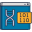

The Following is a Translation of a Course Given at the [*1st ISME (International Society for Microbial Ecology) Latin America Congress 2019*](https://isme-la2019.org)
==================================================================

Bioinformatic Data Analysis for Metagenomes and Amplicons Using R
========================================================================

 Units
----------------------------------

##### The course has six units. Each unit is designed to help you learn and practice a different analysis skill of amplicon or metagenome sequencing data using the R software/programming language. If you have no experience working in R, we recommend you start with unit 1: " Introduction to R: Data manipulation and visualization ".

##### Please review the list of available units below and click on the one you want to practice to go to the tutorial.

###  [Introduction to R: Data manipulation and visualization](https://github.com/tyden46/newTrainings/blob/master/DataAnalysisForMetagenomesAndAmplicons/IntroductionToRDataManipulationAndVisualization.md) 

###  [Sequence Analysis of 16 with DADA2](https://github.com/tyden46/newTrainings/blob/master/DataAnalysisForMetagenomesAndAmplicons/An%C3%A1lisis%20de%20secuencias%20de%2016S%20con%20DADA2.md) 

###  [Introduction to Phyloseq and to Diversity Analysis](https://github.com/tyden46/newTrainings/blob/master/DataAnalysisForMetagenomesAndAmplicons/Introducci%C3%B3n%20a%20phyloseq%20y%20a%20an%C3%A1lisis%20de%20diversidad.md) 

###  [Searching genes of interest in metagenomic shotgun data](https://github.com/tyden46/newTrainings/blob/master/DataAnalysisForMetagenomesAndAmplicons/B%C3%BAsqueda%20de%20genes%20de%20inter%C3%A9s%20en%20datos%20de%20metagen%C3%B3mica%20shotgun.md) 

###  [Genome Visualization and Curation of Metagenome-assembled Genomes (MAGs)](https://github.com/tyden46/newTrainings/blob/master/DataAnalysisForMetagenomesAndAmplicons/Introducci%C3%B3n%20a%20phyloseq%20y%20a%20an%C3%A1lisis%20de%20diversidad.md) 

###  [Microorganism Co-occurrence Networks](https://github.com/tyden46/newTrainings/blob/master/DataAnalysisForMetagenomesAndAmplicons/Redes%20de%20co-ocurrencia%20de%20microorganismos.md) 

##### Note: This course assumes that you have installed R, RStudio, and necessary R packages found [here](http://www.castrolab.org/isme/Requerimientos_WorkshopISME.html)

:

> **This course was designed and distributed by Dr. Eduardo Castro-Nallar's group (eduardo.castro@unab.cl):  
> Dr. Florence Gutzwiller (florence.gutzwiller@gmail.com) and M.Sc. Katterinne N. Mendez (mendez.katterinne@gmail.com)**
> 
> **[CASTRO LAB](http://www.castrolab.org)**
> 
> 
