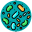

The Following is a Translation of a Course given at the [*1st ISME (International Society for Microbial Ecology) Latin America Congress 2019*](https://isme-la2019.org)
==================================================================

Bioinformatic Data Analysis for Metagenomes and Amplicons Using R
========================================================================

 Units
----------------------------------

##### The course has six units. Each unit is designed to help you learn and practice a different analysis skill of amplicon or metagenome sequencing data using the R software/programming language. If you have no experience working in R, we recommend you start with unit 1: " Introduction to R: Data manipulation and visualization ".
##### Please review the list of available units below and click on the one you want to practice to go to the tutorial.

###  [Introducción a R: Manipulación de datos y visualización](http://www.castrolab.org/isme/introR/introR.html) 

###  [Análisis de secuencias de 16S con DADA2](http://www.castrolab.org/isme/dada2/dada2.html) 

###  [Introducción a phyloseq y a análisis de diversidad](http://www.castrolab.org/isme/biodiversity/biodiversity.html) 

###  [Búsqueda de genes de interés en datos de metagenómica _shotgun_](http://www.castrolab.org/isme/gene_search/gene_search.html) 

###  [Visualización y curación de genomas ensamblados desde metagenomas (MAGs)](http://www.castrolab.org/isme/mags/mags.html) 

###  [Redes de co-ocurrencia de microorganismos](http://www.castrolab.org/isme/microbial_networks/microbial_networks.html) 

##### Nota: Para los días del curso suponemos que los participantes han instalado R y RStudio y los paquetes de R necesarios, siguiendo la guía de requerimientos enviada una semana antes. De lo contrario, puedes hacerlo siguiendo los pasos en el siguiente link:

###  [Antes de comenzar: Instalación de R, RStudio y paquetes](http://www.castrolab.org/isme/Requerimientos_WorkshopISME.html)

  

> **Este curso es diseñado e impartido por el grupo de Dr. Eduardo Castro-Nallar (eduardo.castro@unab.cl):  
> Dr. Florence Gutzwiller (florence.gutzwiller@gmail.com) y M.Sc. Katterinne N. Mendez (mendez.katterinne@gmail.com)**
> 
> **[CASTRO LAB](http://www.castrolab.org)**
> 
> 
