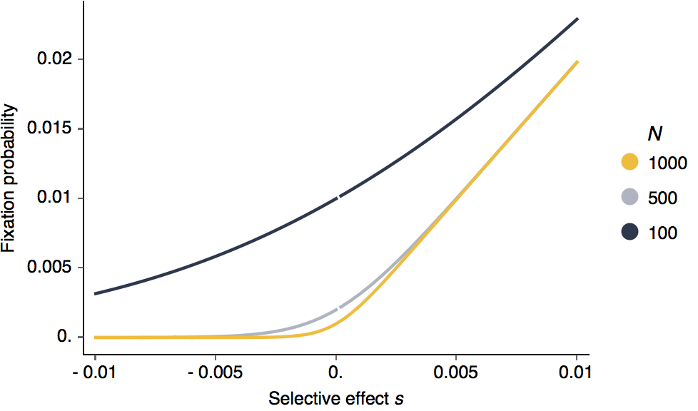
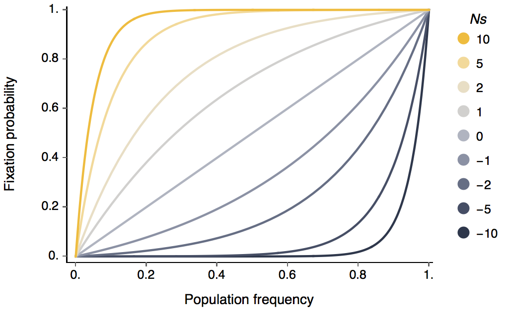

# Summary statistics of population models with selection.

This is all assuming a Wright-Fisher population of discrete non-overlapping generations. Generally, although it's possible to describe in neutral population dynamics in analytic detail, very little cannot be done directly once selection is involved.

## Parameters

* There are a fixed number of *N* individuals.

* Mutations enter the population at a rate of *&mu;* mutations per individual per site per generation.

* We assume there is only a single selective mutation in the population at any given moment. This mutation has selective effect *s*. If *s* is 0.01, then the mutant allele has a 1% greater chance of appearing in the next generation. If *s* is -0.01, then the mutant allele has a 1% lower chance of appearing in the next generation.

## Chance of fixation

A new mutant appears in the population at an initial frequency *p* of `$1/N$`. It has a chance of fixing of

`$$ \mathrm{Pr}(\mathrm{fix}) = \frac{ 1-e^{-2s} }{ 1-e^{-2Ns} } $$`.

In the limit as `$\lim_{N \to \infty}$`, this becomes `$\mathrm{Pr}(\mathrm{fix}) \approx 2s$`.

With different fixed population sizes, it's clear that larger selective effects lead to greater probabilities of fixation:

Looking at this as in terms of log fixation probability, it's clear that negative selection is more efficient than positive selection. 

It's also clear that larger population sizes are more efficient at purging deleterious alleles.

We also know the general probability of an allele fixing that is at current frequency *p*. This is

`$$ \mathrm{Pr}(\mathrm{fix}) = \frac{ 1-e^{-2Nsp} }{ 1-e^{-2Ns} } $$`.

This gives the following relationship between *Ns* and *p* and chance of fixation.

Here, you can see that *N* and *s* only appear together as *Ns*. This means that for probability of fixation, only the scaled selective effect matters. Furthermore, it can be seen that once a positively selected allele reaches appreciable frequency in the population it will almost certainly fix. This is because at this point deterministic selective effects take over from random genetic drift that can cause an allele to be randomly lost while it's still at low frequency.
 