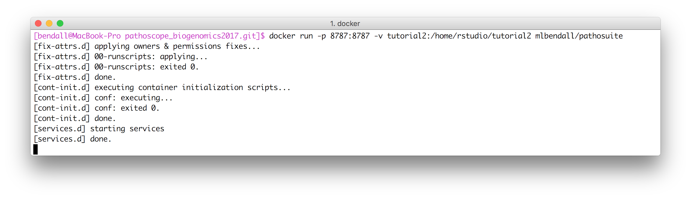
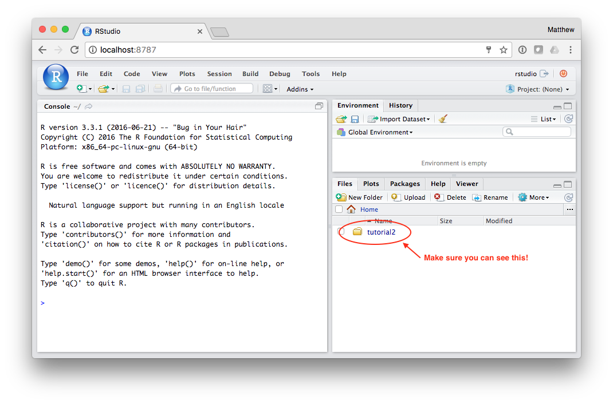
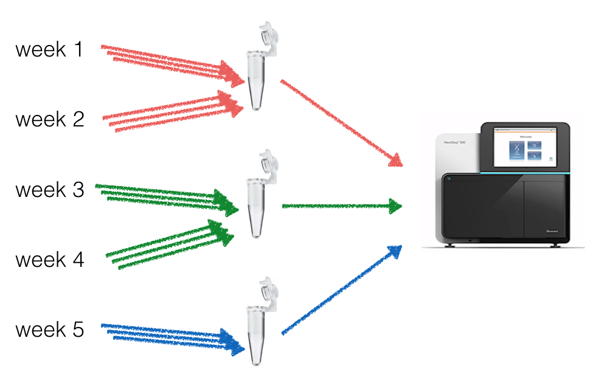
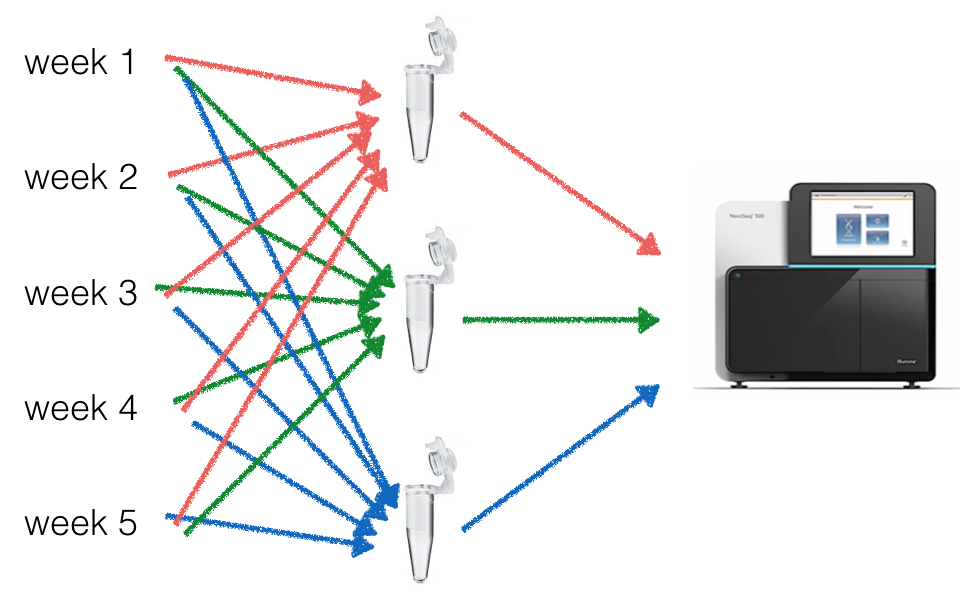

# Metagenome Analysis, Visualization, and Hypothesis Testing with BatchQC and PathoStat

###### In this tutorial, we will learn how to analyze and visualize taxonomic profiles across multiple samples, and use this data to test hypotheses.

> Make sure you are in the `pathoscope_biogenomics2017` directory

> ```bash
cd /path/to/pathoscope_biogenomics2017
```

For this tutorial, we are mainly going to be working in Rstudio and issuing commands through the R console. First, lets use our **pathosuite** Docker image to start up an Rstudio server container:

```bash
docker run -p 8787:8787 -v $(pwd)/tutorial2:/home/rstudio/tutorial2 mlbendall/pathosuite
```

You should see something like this:


Rstudio is now running and can be accessed through your browser.

Open your browser and navigate to [`http://localhost:8787`](http://localhost:8787):


+ **username:** rstudio
+ **password:** rstudio




See [this](../install.md) if you are installing PathoStat outside of Docker.


## Batch Effects: technical sources of variation

In this first exercise we are going to learn how to recognize batch effects and how to control for them.

In your R console, load the `BatchQC` package

```
library(BatchQC)
```

Learn about the features of [batch QC](https://github.com/mani2012/BatchQC)

```r
browseVignettes("BatchQC")
vignette('BatchQCIntro', package='BatchQC')
vignette('BatchQC_examples', package='BatchQC')
vignette('BatchQC_usage_advanced', package='BatchQC')
```

### Exercise 1:

##### You have spent the past 5 weeks in Hawaii sampling volcanic soil after an eruption. Use BatchQC to visualize the data and identify any obvious trends in the microbial composition.

Load the count matrix from the first experiment into _BatchQC_ like this:

```r
load("tutorial2/exercise1.Rdata")
```

This loads the data from two studies, `counts.ts1` and `counts.ts2`. Take a quick peek at the data to make sure it looks like what you are expecting...


#### Timeseries 1:

Load the timeseries 1 data into BatchQC:

```r
batchQC(counts.ts1, samps.ts1$batch, condition=samps.ts1$cond)
```

Take a few minutes to explore this data in BatchQC...

##### Major conclusions to be made from data:

1. ...
2. ...




#### Timeseries 2:

Load the timeseries 2 data into BatchQC:

```r
batchQC(counts.ts2, samps.ts2$batch, condition=samps.ts2$cond)
```

Take a few minutes to explore this data in BatchQC...

##### Major conclusions to be made from data:

1. ...
2. ...





## PathoStat: Metagenomic Visualization and Hypothesis Testing

In this second exercise we are going to use PathoStat to visualize Metagenomic Timeseries data.

In your R console, load the `PathoStat` package

```
library(PathoStat)
```

Learn about the features of [PathoStat](https://github.com/mani2012/PathoStat)

```
vignette('PathoStatIntro', package='PathoStat')
vignette("PathoStatUserManual", package='PathoStat')
vignette("PathoStatAdvanced", package='PathoStat')
```

### Exercise 2:

##### We have collected metagenomic samples from the gut of two individuals over the course of 5 weeks. One of these individuals became infected with a gut bacteria, then got healthy again after treatment. Use PathoStat to identify the infected individual!

The taxonomic profile for each sample has been computed and is in the `tutorial2/exercise2` directory. Also, we have included a table, `sample_data.tsv`, containing the relevant sample data. (The data can be downloaded [here](https://github.com/gwcbi/phylobang/blob/master/tsv.zip?raw=true)).

Load the timeseries data into PathoStat:

```r
pstat <- createPathoStat(input_dir="tutorial2/exercise2",
    sample_data_file="sample_data.tsv")

runPathoStat(pstat)    
```

Now, take a few minutes to explore this data in PathoStat...


The data is time-structured so you can explore the change in microbiome abundances over time. In this case, we have five time points (week) so let's go to the Time Series tab and select 'Time', 'genus', and all taxa but others. You should see something like:  


Since we are using a GUI, you can explore the program options by clicking on the tabs on top and selecting settings from the left-hand panel.

  
    
     
     

